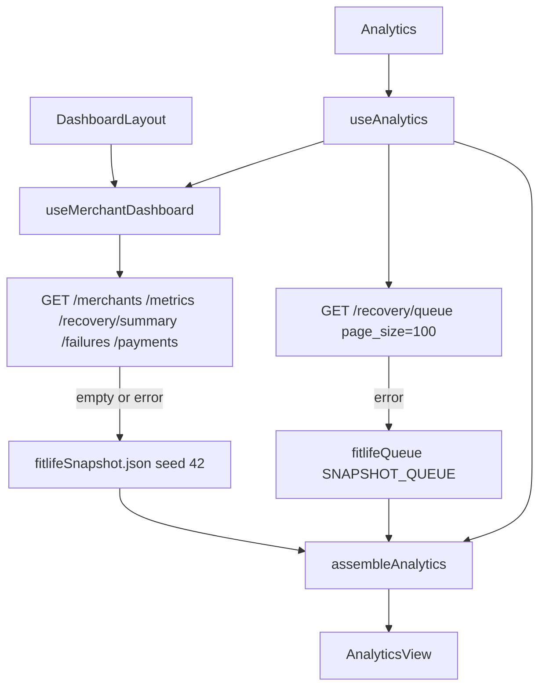

# Analytics UI — Phase 9A

Read-only merchant analytics. Backend APIs, schema, engines, Gemini,
simulator, and Docker are unchanged. Display maps live in the frontend.

Package: `apps/frontend`

Route: `/analytics`

Merchant is selected in the shared top navbar (same FitLife Gym context as
Dashboard and Recovery Queue).

---

## Page layout

```
Analytics
  RangeToggle (7d / 30d / 90d)
  KPI Overview (6 StatCards)
  Recovery performance
    Diagnosis stacked bar | Planner strategy bars
    AI vs baseline grouped bar | Recovery funnel
  Customer insights
    Segment recovered ₹ | Plan recovered ₹
    Promise-to-pay | Top opportunities table
  Operational insights
    Payment method outcomes | Daily recovery trend
    Bank downtime | Salary cycle + festivals
  AI insights
    Four fallback Gemini-shaped cards
    Compliance savings strip
```

Desktop: two-column chart grid. Tablet: stacks. Range applies to queue-derived
charts and the daily trend. **Headline KPIs stay the 90-day cohort** (same
formulas as the merchant dashboard).

---

## Component hierarchy

```
App → DashboardLayout → Analytics
  AnalyticsKpiRow
  DiagnosisStackedChart
  StrategyChart
  AiBaselineChart
  RecoveryFunnelChart          (shared with Dashboard)
  MixBarChart × 2
  PromiseCard
  OpportunitiesTable
  PaymentMethodChart
  RevenueTrendChart            (shared; range owned by page RangeToggle)
  BankDowntimeChart
  CalendarImpactChart
  AnalyticsInsights → InsightCard
```

---

## Data flow



TanStack Query keys: existing `["merchant-dashboard", id]` plus
`["recovery-queue", merchantId, filters, 1, 100, amount, desc]`.

There is **no analytics HTTP route** and **no Gemini HTTP call**. Insight
cards use the same `DashboardSummary` shape as the home dashboard
(`source: "fallback"`, `cached: true`).

---

## Chart sources

| Chart | Source |
| --- | --- |
| KPI Overview | `MerchantMetrics` + `recovery/summary` + snapshot baseline / `harmful_retries_prevented` |
| Recovery by diagnosis (stacked) | Loaded queue rows, status buckets |
| Recovery by planner strategy | Queue rows + `plannerStrategyFor` display map |
| AI vs baseline | Snapshot baseline vs recovered revenue (same lift as Dashboard) |
| Recovery funnel | Dashboard funnel (`recovery/summary` or snapshot) |
| Segment / plan | Queue `customer_segment` / `plan_name` |
| Promise-to-pay | Honour-promise + `WAITING_PROMISE` rows; cohort `waiting_promise` |
| Top opportunities | Open/waiting queue rows × `recoveryProbability` (display-only) |
| Payment method | Queue `payment_method` |
| Daily trend | Snapshot / payments `TrendPoint[]` sliced to 7/30/90 |
| Bank downtime | Snapshot `failure_reasons.BANK_TIMEOUT` + queue recovery rates |
| Salary cycle | Trend recovered ₹ bucketed by day-of-month (1–5 / 6–24 / 25–31) |
| Festivals | Static 2026 calendar (simulator table). FitLife `enable_festival_calendar` is **off**; recovered ₹ that day vs window typical |

Queue sample is the operations catalog (~36 seed rows) when live APIs are
down, or up to 100 live queue rows. Charts that need the full 750-case
ledger (funnel, failure mix, KPIs, trend) use the snapshot / metrics APIs.

---

## KPI calculations

Amounts are integer paise. Same identities as Phase 8A:

| KPI | Formula |
| --- | --- |
| Revenue at risk | `metrics.revenue_at_risk` |
| Revenue recovered | `metrics.recovered_revenue` |
| Recovery rate | `metrics.recovery_rate` (0–1) |
| AI lift vs baseline | `recovered_revenue − baseline.recovered_revenue` |
| Pending recovery value | `recovery_summary.pending_recovery_value` |
| Harmful retries prevented | snapshot `harmful_retries_prevented` (117 on seed 42) |

Seed-42 FitLife (as of 2026-09-02 IST): at risk ₹8,42,250 · recovered
₹5,83,495 · rate 69.3% · lift ₹2,96,746 · pending ₹48,952 · harmful
retries 117.

Promise success (sample): `recovered honour-promise / (recovered + active)`.
Expected recovered on opportunities: `round(amount × recoveryProbability)`.

Suppressed revenue (compliance strip): `metrics.suppressed_revenue`.

---

## Range filter

Window end is snapshot `as_of` (`2026-09-02`). Start is `as_of − N days`.

- 7d / 30d / 90d slice `failed_at` on queue charts and `TrendPoint.date`.
- Festival rows are listed only when their date falls in the window.
- KPIs, funnel, baseline lift, and BANK_TIMEOUT cohort counts stay 90-day.

---

## Constraints

No action buttons, retries, or engine calls. Merchant switch uses the
existing navbar. Money remains integer paise; the UI only formats it.
