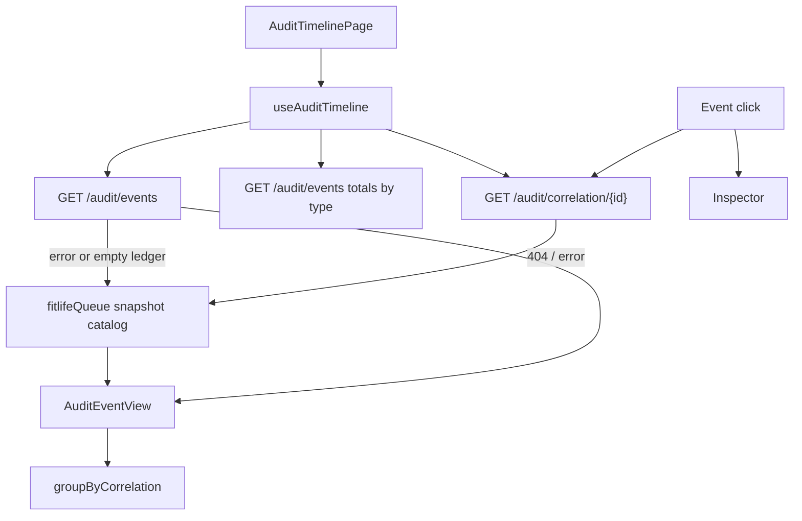

# Audit Timeline UI — Phase 9B

Read-only compliance explorer. Backend APIs, schema, engines, Gemini,
simulator, and Docker are unchanged. Display maps live in the frontend.

Package: `apps/frontend`

Route: `/audit`

Deep links: `/audit?correlation=` and `/audit?case=`

Merchant is selected in the shared top navbar. Audit routes are not
merchant-scoped on the API; FitLife seed-42 is the fallback catalog.

---

## Page layout

```
Audit Timeline
  AuditMetricsHeader (5 StatCards)
  ComplianceInsightsCard (compact chips)
  Sticky toolbar: AuditFilters + Export JSON/CSV + Replay
  60% Workflows (grouped by correlation) | 40% sticky Inspector
```

Desktop: `3fr / 2fr`. Tablet: inspector stacks under the feed.

The right column is a **sticky inspector**, not a tall empty panel. JSON,
replay flow, latency, and ids load there when an event is selected.

---

## Component hierarchy

```
App → DashboardLayout → AuditTimelinePage
  AuditMetricsHeader
  ComplianceInsightsCard
  AuditFilters
    AuditExportButtons
    Replay
  CorrelationGroupCard[]
    TimelineEventCard[]          (~70px collapsed)
  AuditInspector (sticky)
    CorrelationReplay            (stage strip)
    JsonPayloadViewer
```

Shared: `StatCard`, `EmptyState`, `ErrorState`, `DashboardSkeleton`.

The case-drawer `AuditEventCard` is unchanged.

---

## Data flow



TanStack Query keys: `["audit-events", filters, page]`, `["audit-kpis"]`,
`["audit-correlation", inspectId]`.

There is **no new HTTP route**. Explorer filters map onto the existing
query string: `correlation_id`, `recovery_case_id`, `actor`, `event_type`,
`date_from`, `date_to`, `page`, `page_size`.

`actor` is sent as an `ActorType` token (`POLICY_ENGINE`, `CUSTOMER`) or an
`actor_name` substring (`Diagnosis Agent`, `Scheduler`, `Recovery Executor`,
`Razorpay Webhook`, `Gemini`). `event_type` must be an `AuditEventType`.

Severity (Info / Warning / Error) is **client-only**. It is derived from
event type and `policy_decision`.

---

## Replay flow

Selecting an event (or **Replay** in the toolbar) loads
`GET /audit/correlation/{correlation_id}` into the inspector. Stages:

Diagnosis → Policy → Planner → Executor → Webhook → Outcome

(Payment Failed is still in the chronological event list.)

Latency is `timestamp[n] − timestamp[n-1]`. Live and snapshot catalogs
use the recovery case UUID as `correlation_id`.

---

## Filters

| Control | API | Notes |
| --- | --- | --- |
| Correlation ID | `correlation_id` | Substring. Replay uses inspect id. |
| Recovery Case ID | `recovery_case_id` | Sent only when the value is a UUID. |
| Actor | `actor` | Display buckets above. |
| Event Type | `event_type` | `AuditEventType` enum. |
| From / To | `date_from` / `date_to` | `YYYY-MM-DD`. |
| Severity | none | Client filter on the loaded page. |

---

## Payload viewer

`JsonPayloadViewer` lives in the inspector. Live payloads are the safe
key subset copied by the audit service. Full `structured_payload` is
never fetched.

---

## KPI calculations

Unchanged from the previous explorer. Compliance chips (STOP vs ALLOW,
escalations, duplicates, idempotency keys) are counted on the **loaded
sample**.

---

## Export

JSON and CSV sit in the **filter toolbar** and download the visible page.
No backend export endpoint.

---

## Constraints

No action buttons, retries, or engine calls. Money is not shown on this
page. Audit payloads stay read-only.
