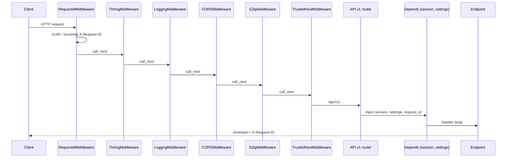
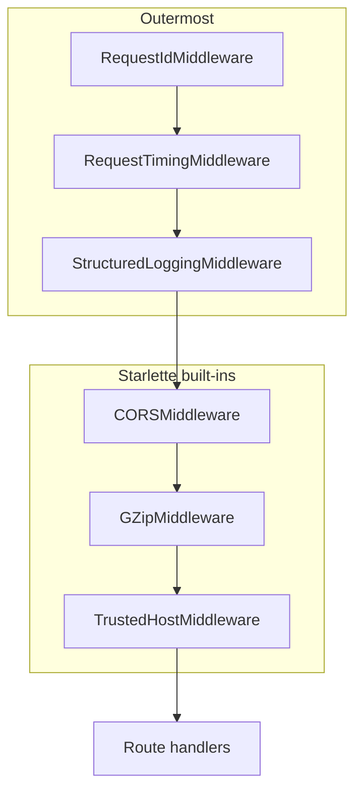
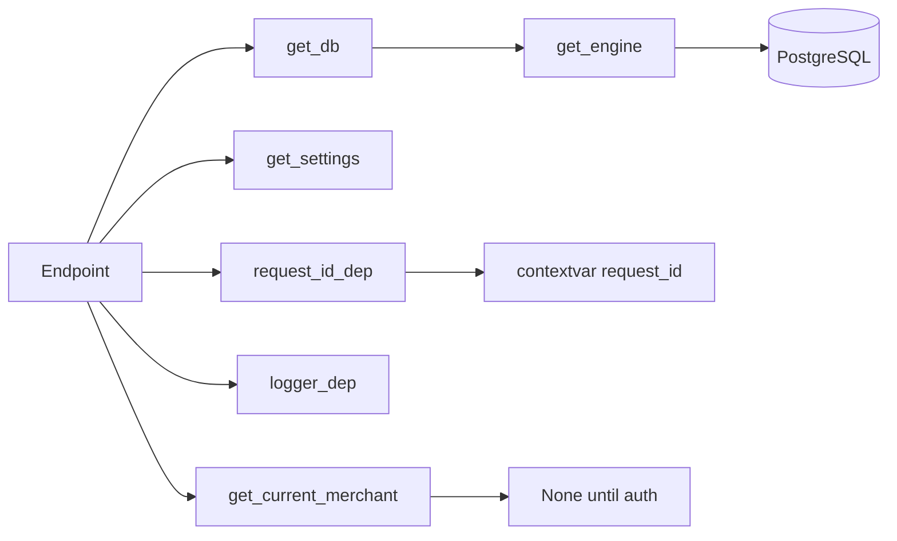
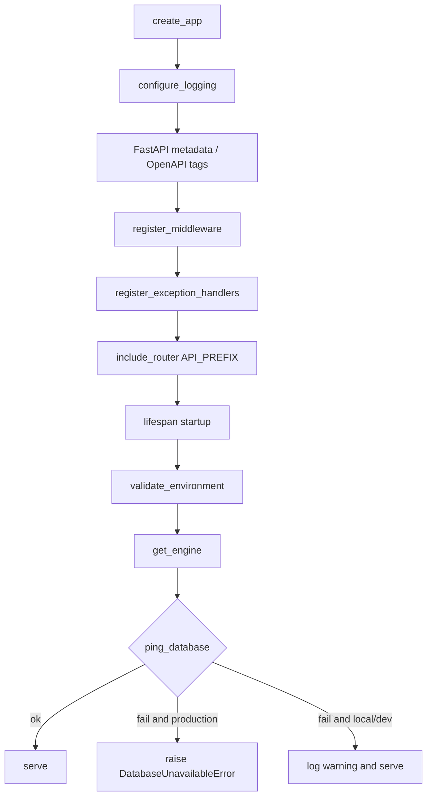

# Backend architecture — Phase 4A

FastAPI foundation for RecoveryPilot AI (Razorpay Hackathon Track 03).
This phase is **infrastructure only**: no diagnosis, planner, Razorpay calls,
Gemini, or payment execution.

Run locally:

```powershell
uv run uvicorn app.main:app --reload --app-dir apps/backend
```

OpenAPI: [http://localhost:8000/docs](http://localhost:8000/docs) · ReDoc `/redoc`.

---

## Folder map

```
apps/backend/app/
├── main.py                 # app = create_app() only
├── api/
│   ├── deps.py             # session, settings, request_id, logger, merchant
│   └── v1/
│       ├── router.py       # central /api/v1 registration
│       ├── health.py
│       ├── merchants.py    # placeholders
│       ├── recovery.py     # placeholders
│       ├── audit.py        # placeholders
│       └── simulator.py    # placeholders
├── config/
│   ├── settings.py         # Pydantic BaseSettings
│   ├── logging.py          # JSON logger factory
│   ├── constants.py        # API_PREFIX, timezone, pool, page size
│   └── environment.py      # startup validation
├── core/
│   ├── lifespan.py         # create_app(), lifespan, exception handlers
│   ├── middleware.py
│   ├── exceptions.py
│   └── responses.py        # success / error envelopes
├── db/
│   ├── session.py          # engine, pool, get_db
│   ├── base.py
│   ├── models.py           # re-export of database.models
│   └── health.py           # SELECT 1
├── schemas/                # HTTP envelopes; domain schemas stay in shared/
├── services/               # empty — domain logic stays in repo services/
└── utils/                  # request_id, time, pagination, uuid, json
```

Canonical ORM tables remain in `database/models/`. Routers must not contain
domain recovery rules (`services/` at the repo root owns those in later phases).

---

## Request lifecycle



Every response (success or error) includes `request_id` and `timestamp`.
The same id is returned as `X-Request-ID`.

---

## Middleware pipeline

Starlette applies middleware in reverse registration order. **Last added is outermost.**



| Middleware | Role |
| --- | --- |
| Request ID | UUID per request; `X-Request-ID` |
| Timing | `latency_ms` + `X-Response-Time-Ms` |
| Structured logging | JSON access log: method, path, status, latency, request_id |
| CORS | Origins from `CORS_ORIGINS` |
| GZip | Bodies over 500 bytes |
| Trusted Host | Hosts from `TRUSTED_HOSTS` |

---

## Dependency injection



`app/api/deps.py` exposes annotated aliases: `SessionDep`, `SettingsDep`,
`RequestIdDep`, `LoggerDep`, `MerchantDep`.

---

## Application startup



Shutdown disposes the SQLAlchemy pool and logs `app.shutdown`.

Environment must be one of `local`, `development`, `staging`, `production`.
`DATABASE_URL` and `API_VERSION` are required. Secrets (`RAZORPAY_*`,
`GEMINI_API_KEY`) are placeholders and are never written to logs.

---

## Logging

JSON lines to stdout via `JsonLogFormatter`:

| Field | Source |
| --- | --- |
| timestamp | UTC ISO-8601 |
| level | INFO / DEBUG / WARNING / ERROR |
| logger | logger name |
| message | log message |
| environment | `APP_ENV` |
| request_id | contextvar or record extra |
| method, path, status_code, latency_ms | access middleware extras |

Factory: `app.config.logging.get_logger`.

---

## Health

| Method | Path | Meaning |
| --- | --- | --- |
| GET | `/api/v1/health` | Process liveness. Always 200. `data.database` is `connected` or `unavailable`. |
| GET | `/api/v1/health/database` | Readiness. 200 or 503 `database_unavailable`. |

Docker `HEALTHCHECK` and Compose use `/api/v1/health`.

---

## Error handling

All failures use:

```json
{ "success": false, "error": "...", "code": "...", "request_id": "...", "timestamp": "..." }
```

| Exception | HTTP | Code |
| --- | --- | --- |
| `DatabaseUnavailableError` | 503 | `database_unavailable` |
| `RecoveryNotFoundError` | 404 | `recovery_not_found` |
| `PolicyViolationError` | 403 | `policy_violation` |
| `ValidationException` / `RequestValidationError` | 422 | `validation_error` |
| `ApplicationException` | mapped | mapped |
| Unhandled | 500 | `internal_error` |

Success:

```json
{ "success": true, "message": "ok", "data": {}, "request_id": "...", "timestamp": "..." }
```

Builders: `success_body`, `error_body`, `error_response` in `app/core/responses.py`.

---

## OpenAPI

- Title: **RecoveryPilot AI Backend**
- Description: AI Revenue Recovery Agent for Razorpay Track 03
- Tags: Health, Merchants, Recovery, Audit, Simulator
- Docs: `/docs` · ReDoc `/redoc` · schema `/openapi.json`

Placeholder routers return sample envelopes only. They do not query Postgres.

---

## Tests

```powershell
cd apps/backend
uv run pytest
```

| File | Asserts |
| --- | --- |
| `test_health.py` | `/api/v1/health` is 200 and echoes `X-Request-ID` |
| `test_settings.py` | Settings load; illegal `APP_ENV` rejected |
| `test_database.py` | Engine and `get_db` initialize without a live query |
