# Backend architecture — Phase 4D

FastAPI backend for RecoveryPilot AI (Razorpay Hackathon Track 03).
Phase 4A delivered the HTTP foundation. Phase 4B added read-only merchant
dashboard APIs. Phase 4C added the recovery queue. Phase 4D adds **audit
timeline and compliance replay**. There is still **no** diagnosis, planner,
Razorpay call, Gemini, scheduler, or payment execution.

Run locally:

```powershell
uv run uvicorn app.main:app --reload --app-dir apps/backend
```

OpenAPI: [http://localhost:8000/docs](http://localhost:8000/docs) · ReDoc `/redoc`.

---

## Folder map

```
apps/backend/app/
├── main.py                 # app = create_app() only
├── api/
│   ├── deps.py             # session, settings, request_id, correlation_id, logger
│   └── v1/
│       ├── router.py       # central /api/v1 registration
│       ├── health.py       # /live, /ready, /health, /health/database
│       ├── merchants.py    # dashboard (thin; no SQL)
│       ├── recovery.py     # queue, case, timeline, summary (thin)
│       ├── audit.py        # timeline, explorer, correlation, policy (thin)
│       └── simulator.py    # placeholders
├── config/
│   ├── settings.py         # Pydantic BaseSettings; get_settings() is @lru_cache
│   ├── logging.py          # JSON logger factory (request_id + correlation_id)
│   ├── constants.py
│   └── environment.py
├── core/
│   ├── lifespan.py         # create_app(), lifespan, exception handlers
│   ├── middleware.py       # TrustedHost → CORS → GZip → IDs → timing → logs
│   ├── exceptions.py
│   └── responses.py        # ApiResponse / PaginatedResponse / ErrorResponse
├── db/                     # engine, get_db, SELECT 1
├── schemas/
│   ├── common.py           # ApiResponse[T], PaginatedResponse[T], ErrorResponse
│   ├── merchant_dashboard.py
│   ├── recovery.py         # RecoveryQueueItem, case, timeline, summary
│   └── audit.py            # AuditEventResponse, timeline, correlation, policy
├── services/
│   ├── merchant_service.py # HTTP adapter; maps ORM → Pydantic, 404
│   ├── recovery_service.py # HTTP adapter for the recovery queue
│   └── audit_service.py    # HTTP adapter for compliance replay
└── utils/                  # pagination (PageMeta), request_id, time

services/src/services/
├── merchant_service.py     # merchant dashboard SQLAlchemy queries
├── recovery_service.py     # recovery queue SQLAlchemy queries
└── audit_service.py        # audit_logs replay SQLAlchemy queries
```

Canonical ORM tables remain in `database/models/`. Domain queries live in
`services/`. Routers only parse parameters, call the adapter, and wrap envelopes.

---

## API flow

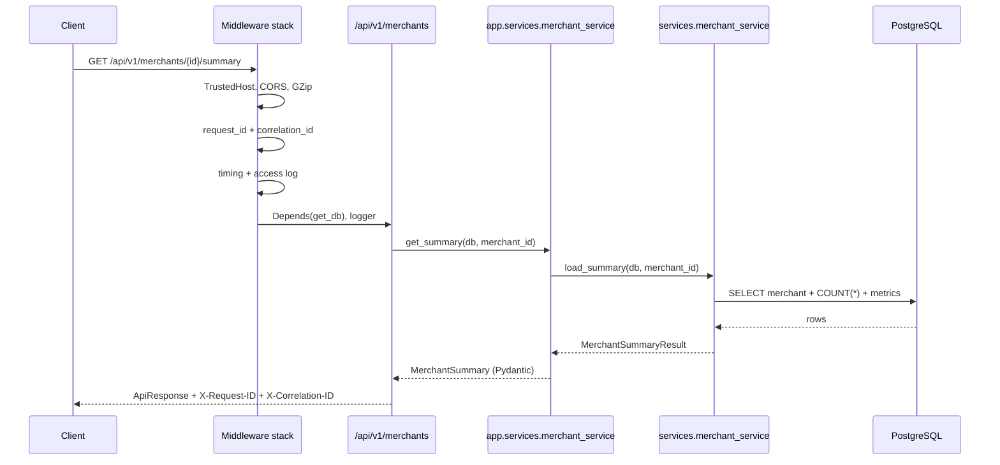

| Route | Service call | Envelope |
| --- | --- | --- |
| `GET /api/v1/merchants/{merchant_id}/summary` | `get_summary` | `ApiResponse[MerchantSummary]` |
| `GET /api/v1/merchants/{merchant_id}/metrics` | `get_metrics` | `ApiResponse[MerchantMetricsPayload]` |
| `GET /api/v1/merchants/{merchant_id}/payments` | `list_payments` | `PaginatedResponse[PaymentListItem]` |
| `GET /api/v1/merchants/{merchant_id}/failures` | `list_failures` | `PaginatedResponse[FailureListItem]` |

Payments and failures accept `page` (1-based) and `page_size` (clamped to 100).
Unknown `merchant_id` returns HTTP 404 `merchant_not_found`.

---

## Recovery API flow

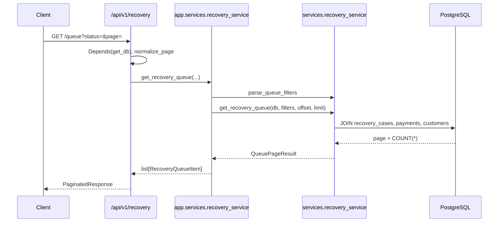

| Route | Service call | Envelope |
| --- | --- | --- |
| `GET /api/v1/recovery/queue` | `get_recovery_queue` | `PaginatedResponse[RecoveryQueueItem]` |
| `GET /api/v1/recovery/cases/{recovery_case_id}` | `get_recovery_case` | `ApiResponse[RecoveryCaseResponse]` |
| `GET /api/v1/recovery/cases/{recovery_case_id}/timeline` | `get_recovery_timeline` | `ApiResponse[list[RecoveryTimelineEvent]]` |
| `GET /api/v1/recovery/summary` | `get_recovery_summary` | `ApiResponse[RecoverySummaryResponse]` |

Unknown `recovery_case_id` returns HTTP 404 `recovery_case_not_found`.

---

## Queue filtering flow

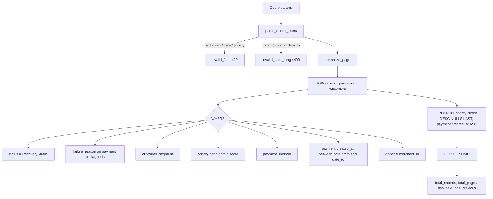

`priority` accepts `HIGH` (≥ 0.8), `MEDIUM` (0.6–0.8), `LOW` (< 0.6), or a numeric minimum score.

---

## Recovery case lifecycle

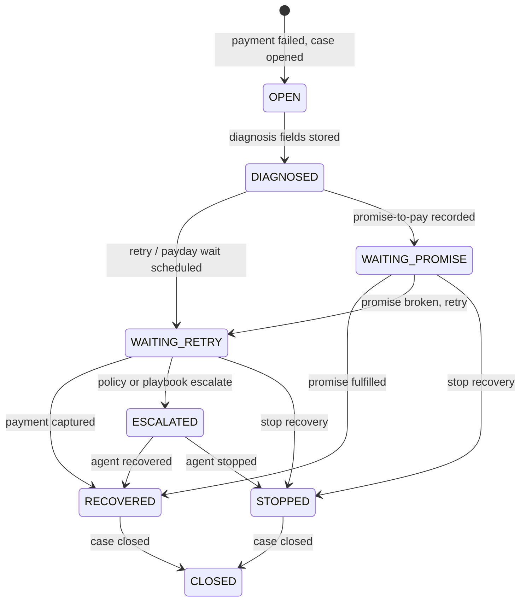

Timeline events (ascending `occurred_at`): payment failed → diagnosis created → actions scheduled/executed → webhook updates → audit summaries. This phase **reads** those rows; it does not run diagnosis, policy, or Razorpay.

---

## Merchant service layer

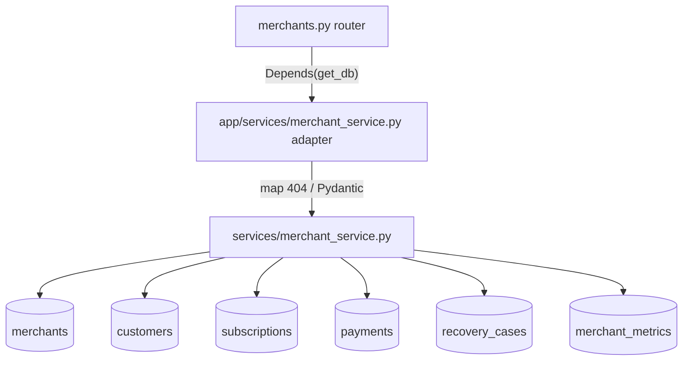

- **`services.merchant_service`**: SQLAlchemy `select` / `func.count` / `db.get`.
  Raises domain `MerchantNotFoundError`. Returns ORM + counts.
- **`app.services.merchant_service`**: Catches the domain miss, raises
  `app.core.exceptions.MerchantNotFoundError` (HTTP 404), builds dashboard DTOs.
  Metrics with no snapshot row become zeros, not 404.
- Failures are `payment_status = FAILED`, newest `created_at` first, left-joined
  to `recovery_cases` for `recovery_status`.

---

## Recovery service layer

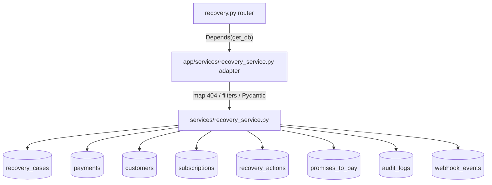

- **`services.recovery_service`**: `get_recovery_queue`, `get_recovery_case`, `get_recovery_timeline`, `get_recovery_summary`. Raises domain `RecoveryCaseNotFoundError`, `InvalidFilterError`, `InvalidDateRangeError`.
- **`app.services.recovery_service`**: Maps those onto HTTP exceptions and dashboard DTOs. Never returns ORM.
- Webhooks have no FK; timeline matches `payload.payload.payment.entity.id` to `payments.razorpay_payment_id`. Audit events on the recovery timeline are **summaries only**; full compliance replay lives under `/api/v1/audit`.

---

## Audit service architecture

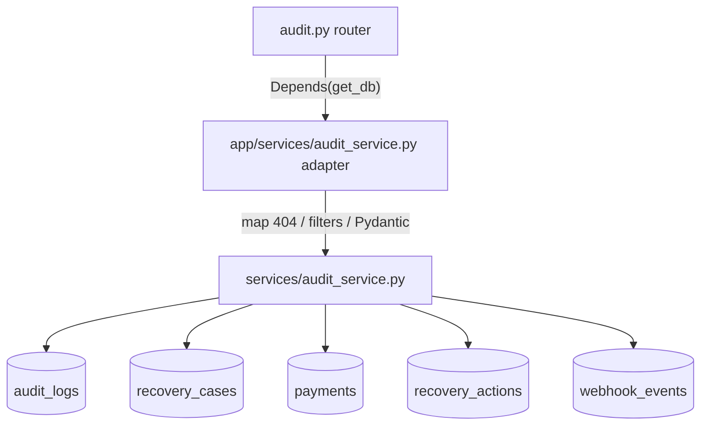

| Route | Service call | Envelope |
| --- | --- | --- |
| `GET /api/v1/audit/cases/{recovery_case_id}` | `get_case_audit_timeline` | `ApiResponse[AuditTimelineResponse]` |
| `GET /api/v1/audit/events` | `get_audit_events` | `PaginatedResponse[AuditEventResponse]` |
| `GET /api/v1/audit/correlation/{correlation_id}` | `get_correlation_trace` | `ApiResponse[CorrelationTraceResponse]` |
| `GET /api/v1/audit/cases/{recovery_case_id}/policy` | `get_policy_decisions` | `ApiResponse[list[PolicyDecisionResponse]]` |

`audit_logs.structured_payload` is read-only. Reviewer DTOs copy a small safe key subset (`reason`, `model`, `confidence`, …). Stored JSON is never rewritten.

Each event exposes `request_id` and `correlation_id`. Those columns do not exist on `audit_logs`; values come from payload keys when present, otherwise `correlation_id` is the recovery case id (one workflow) and `request_id` is the audit row id.

Policy `BLOCK` is presented as **DENY**. `RECOVERY_STOPPED` is presented as **STOP**. If a case has no policy rows, the API returns one placeholder `ALLOW` (`recovery_policy_v1`).

---

## Correlation ID replay flow

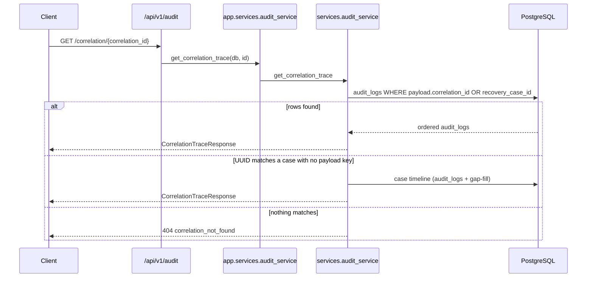

Explorer filters (`GET /events`) also accept `correlation_id` and `request_id` and sort **newest first**.

---

## Compliance timeline

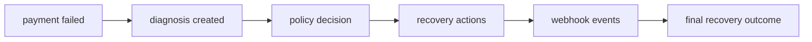

`GET /audit/cases/{id}` merges `audit_logs` (source of truth) with gap-fill from payments, actions, webhooks, and terminal `recovery_status`. Events are sorted by timestamp **ascending**. Each item includes `event_type`, `actor`, `timestamp`, `summary`, `request_id`, and `correlation_id`.

---

## Request → Audit → Database

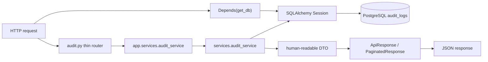

Routers never return ORM objects. `structured_payload` is not echoed in full.

---

## Request → Service → Database

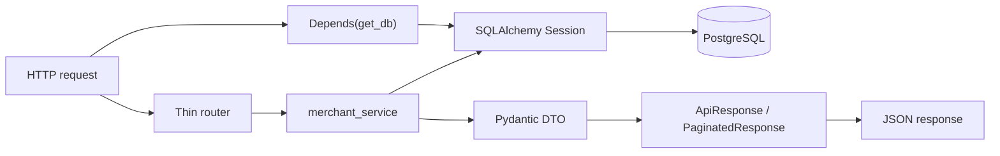

Routers never return ORM objects. Money stays integer paise.

---

## Request lifecycle (middleware)

Starlette applies middleware in reverse registration order. **Last added is outermost.**

Request flow (outer → inner):

**TrustedHost → CORS → GZip → Request ID → Request Timing → Structured Logging → Exception Handling → route**

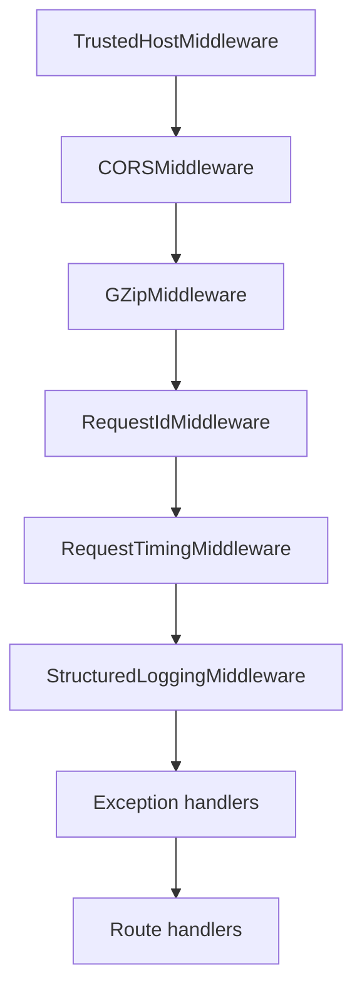

| Middleware | Role |
| --- | --- |
| Trusted Host | Hosts from `TRUSTED_HOSTS` |
| CORS | Origins from `CORS_ORIGINS`; exposes `X-Request-ID` and `X-Correlation-ID` |
| GZip | Bodies over 500 bytes |
| Request ID | `request_id` from `X-Request-ID` or a new UUID; `correlation_id` from `X-Correlation-ID` or the same as `request_id` |
| Timing | `latency_ms` + `X-Response-Time-Ms` |
| Structured logging | JSON access log: method, path, status, latency, both ids |
| Exception handling | Standard `ErrorResponse` envelope |

Every success or error body includes `request_id`, `correlation_id`, and `timestamp`.

---

## Dependency injection

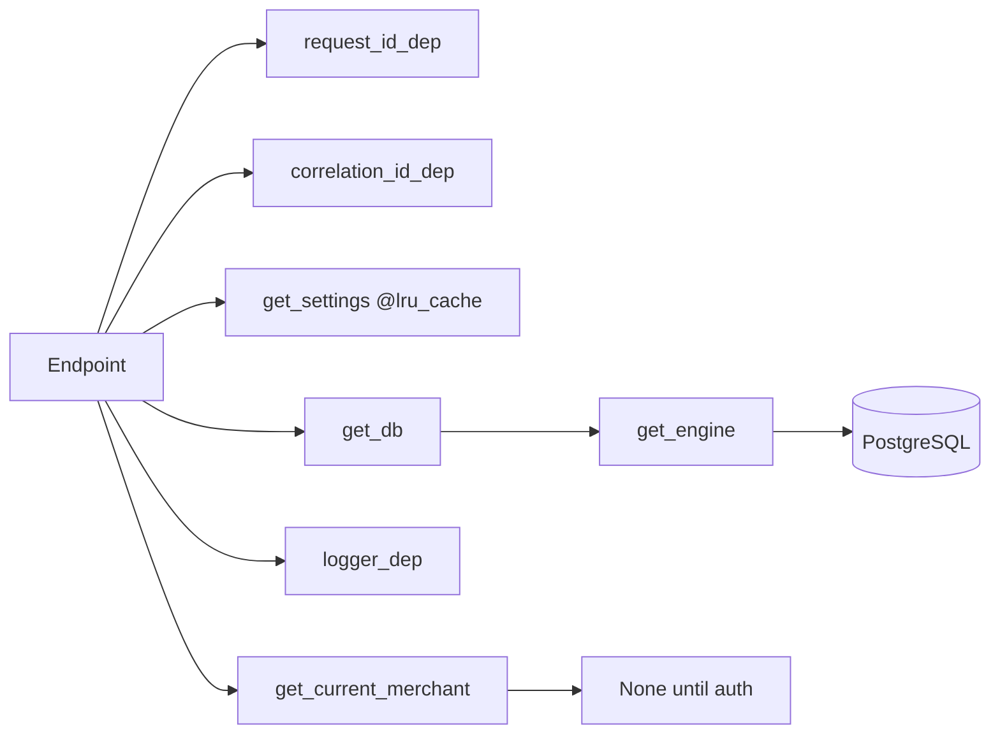

`Settings()` is constructed once via `get_settings()` (`@lru_cache(maxsize=1)`).

---

## Application startup

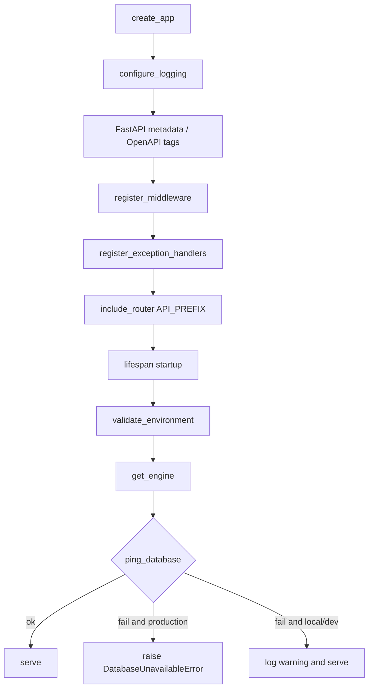

Shutdown disposes the SQLAlchemy pool and logs `app.shutdown`.

Environment must be one of `local`, `development`, `staging`, `production`.
`DATABASE_URL` and `API_VERSION` are required. Secrets are never written to logs.

---

## Logging

JSON lines to stdout via `JsonLogFormatter`:

| Field | Source |
| --- | --- |
| timestamp | UTC ISO-8601 |
| level | INFO / DEBUG / WARNING / ERROR |
| logger | logger name |
| message | log message |
| environment | `APP_ENV` |
| request_id | contextvar or record extra |
| correlation_id | contextvar or record extra |
| method, path, status_code, latency_ms | access middleware extras |

---

## Health

| Method | Path | Meaning |
| --- | --- | --- |
| GET | `/api/v1/live` | Process liveness. Always 200. No database call. |
| GET | `/api/v1/ready` | Readiness. 200 if Postgres answers `SELECT 1`, else 503. |
| GET | `/api/v1/health` | Combined. Always 200. `data.database` is `connected` or `unavailable`. |
| GET | `/api/v1/health/database` | Same check as `/ready`. |

Docker `HEALTHCHECK` and Compose use `/api/v1/health`.

---

## Error handling

All failures use:

```json
{
  "success": false,
  "error": "...",
  "code": "...",
  "request_id": "...",
  "correlation_id": "...",
  "timestamp": "..."
}
```

| Exception | HTTP | Code |
| --- | --- | --- |
| `DatabaseUnavailableError` | 503 | `database_unavailable` |
| `MerchantNotFoundError` | 404 | `merchant_not_found` |
| `RecoveryNotFoundError` | 404 | `recovery_case_not_found` |
| `InvalidFilterError` | 400 | `invalid_filter` |
| `InvalidDateRangeError` | 400 | `invalid_date_range` |
| `AuditEventNotFoundError` | 404 | `audit_event_not_found` |
| `CorrelationNotFoundError` | 404 | `correlation_not_found` |
| `InvalidAuditFilterError` | 400 | `invalid_audit_filter` |
| `PolicyViolationError` | 403 | `policy_violation` |
| `ValidationException` / `RequestValidationError` | 422 | `validation_error` |
| `ApplicationException` | mapped | mapped |
| Unhandled | 500 | `internal_error` |

Success:

```json
{
  "success": true,
  "message": "ok",
  "data": {},
  "request_id": "...",
  "correlation_id": "...",
  "timestamp": "..."
}
```

Paginated success adds `page`, `page_size`, `total`, `total_records`, `total_pages`, `has_next`, and `has_previous`. `utils/pagination.py` (`normalize_page`, `build_page_meta`) is the reusable helper.

Builders: `success_body`, `paginated_body`, `error_body`, `error_response` in
`app/core/responses.py`. Generic models live in `app/schemas/common.py`.

---

## OpenAPI

- Title: **RecoveryPilot AI Backend**
- Description: AI Revenue Recovery Agent for Razorpay Track 03
- Tags: Health, Merchants, Recovery, Audit, Simulator
- Docs: `/docs` · ReDoc `/redoc` · schema `/openapi.json`

Recovery queue and audit replay routes query PostgreSQL. Simulator routers remain placeholders. Merchant dashboard routes query PostgreSQL.

---

## Tests

```powershell
cd apps/backend
uv run pytest
```

| File | Asserts |
| --- | --- |
| `test_health.py` | `/live` and `/health` are 200; request and correlation ids echo |
| `test_merchants.py` | Dashboard paths are registered; unknown UUID is 404 when Postgres is up |
| `test_recovery.py` | Queue paths registered; `invalid_filter` / `invalid_date_range`; case 404 when Postgres is up |
| `test_audit.py` | Audit paths registered; `invalid_audit_filter`; correlation 404 when Postgres is up |
| `test_pagination.py` | `normalize_page` clamps size; `build_page_meta` computes pages and cursors |
| `test_settings.py` | Settings load; `get_settings` is cached; illegal `APP_ENV` rejected |
| `test_database.py` | Engine and `get_db` initialize without a live query |
