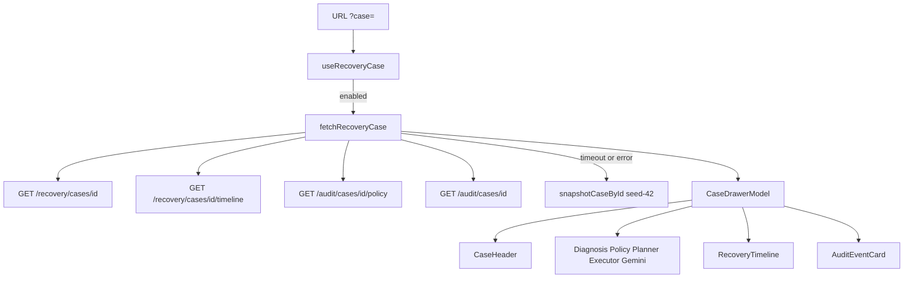

# Case Drawer UI — Phase 8C

Read-only right-side inspector for one recovery case. Backend APIs, schema,
diagnosis, policy, planner, executor, Gemini, simulator, and Docker are
unchanged. Display maps stay in the frontend.

Package: `apps/frontend`

Opened from `/recovery-queue?case=<recovery_case_id>`. The queue table stays
mounted underneath.

---

## Component hierarchy

```
RecoveryQueue
  RecoveryCaseDrawer
    CaseHeader
    DiagnosisCard
    PolicyCard
    PlannerCard
    ExecutorCard
    GeminiExplanationCard
    RecoveryTimeline
    AuditEventCard[]
```

Shared: `StatusBadge`, `PriorityBadge`, `JsonHighlight`, `EmptyState`,
`ErrorState`.

`ExecutorCard` is the Phase 8C name for the executor snapshot. There is no
retry, edit, or execute control.

---

## Drawer lifecycle

1. A queue row click (or a dashboard deep-link) writes `?case=` without
   leaving `/recovery-queue`.
2. `useRecoveryCase(id)` is **disabled** until `case` is set (lazy load).
3. TanStack Query caches `["recovery-case", recovery_case_id]` for 30s.
4. The panel slides in from the right (`max-w-[480px]` on `sm+`, full width
   on phones) with a 200ms Framer Motion tween. Backdrop opacity fades with
   it. `prefers-reduced-motion` is honored via global CSS.
5. Close paths: **ESC**, backdrop click, close button. All three delete
   `?case=`. Body scroll is locked while open.
6. Focus moves to the first control in the panel. Tab wraps inside the
   drawer (live query of focusable nodes so skeleton → content still traps).
   On close, focus returns to the row that opened it.

Loading uses a header + card skeleton. Fetch errors show `ErrorState` with
Retry (refetch only). A missing id after both live and snapshot miss shows
the empty state.

---

## Data flow



There is **no Gemini HTTP route**. Merchant / customer / compliance copy is
the local fallback template (`explanation_prompt_v1`, source `fallback`).
Cached is true for the simulator snapshot.

Expected recovered amount is `round(payment.amount * recovery_probability)`
in the existing display map — not a new engine.

Webhook replay is a badge when timeline `details.duplicate|replay` or
`action_metadata.webhook_replay` is set. The UI never replays webhooks.

---

## Timeline rendering

Events come from `GET /recovery/cases/{id}/timeline`, sorted by
`occurred_at`. Snapshot cases synthesize the same types from the queue row.

| API `event_type` | Label |
| --- | --- |
| `payment_failed` | Payment Failed |
| `diagnosis_created` | Diagnosis |
| `audit` | Policy |
| `action_scheduled` | Planner |
| `action_executed` | Execution Scheduled |
| `webhook_update` | Webhook Received |
| webhook + captured / paid | Payment Captured |
| executed / webhook + stop | Stopped |

Canonical journey shown when those events exist:

Payment Failed → Diagnosis → Policy → Planner → Execution Scheduled →
Webhook Received → Payment Captured / Stopped.

Each row is a button. Expand shows pretty-printed `details` via
`JsonHighlight` (keys = info blue, strings = recovered green, numbers =
waiting orange, literals = AI purple). Icons: orange = failed/waiting,
purple = diagnosis/policy, blue = planner/executor/webhook, green =
captured, gray = stopped.

---

## Audit rendering

`GET /audit/cases/{id}` (fallback `GET /audit/events?recovery_case_id=`)
feeds `AuditEventCard`, chronological as returned.

Collapsed row: summary, timestamp, actor, actor type, event type.

Expanded row: request ID, correlation ID, optional policy decision,
“Expand JSON payload”.

Empty audit list uses `EmptyState`. Payloads are display-only.

---

## Section notes

**Customer overview (`CaseHeader`)** — initials avatar, name, segment, plan,
amount at risk, recovery status, priority, copyable Case ID and Payment ID.

**Diagnosis** — primary reason, High/Medium/Low confidence bar, evidence
list with weight bars, triggered-rule chips, model + version badges.

**Policy** — ALLOW / WAIT / STOP / ESCALATE / DENY badge, decision priority,
reasons, allowed/blocked channel chips, live cooldown countdown when
`cooldown_until` is set, evaluated-rules table.

**Planner** — primary + fallback strategy, scheduled time, probability bar,
expected recovered (green), estimated communication cost.

**Executor** — status, type, execution ID, idempotency key, scheduled /
executed timestamps, blue webhook-replay badge.

**Gemini** — Merchant / Customer / Compliance tabs. Badges: Gemini or
Fallback, Cached, prompt version, generated time.

---

## Constraints

No action buttons, retry execution, case edits, or Gemini HTTP calls in
this phase. Money remains integer paise; the UI only formats for display.
