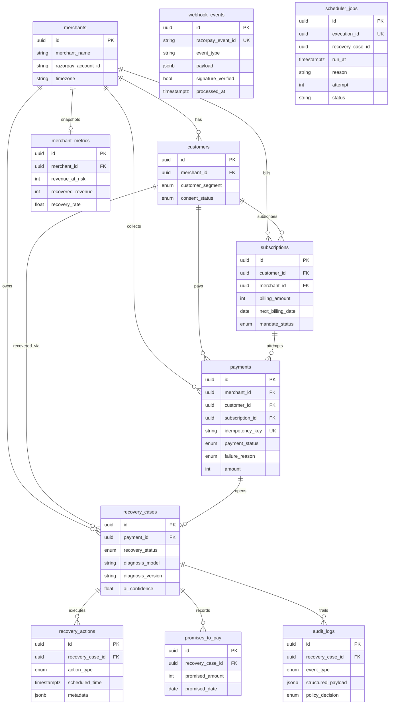
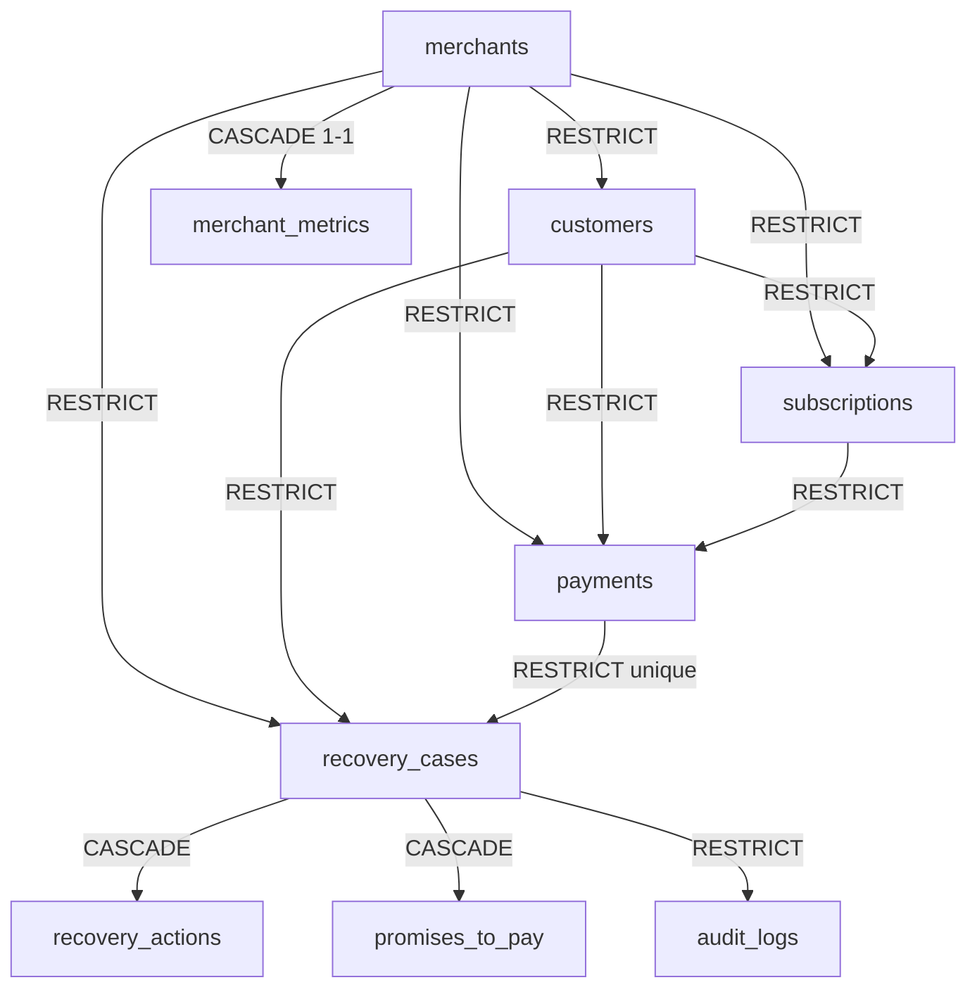

# RecoveryPilot AI database schema

PostgreSQL schema for Track 03 revenue recovery: subscriptions, Razorpay payment lifecycle, AI recovery workflow, policy gates, audit replay, merchant analytics, and batch simulation.

Amounts are **integer paise**. Timestamps are **timestamptz (UTC)**. Primary keys are **UUID**.

Generate migrations from the ORM (do not hand-write version files):

```powershell
python -m uv run alembic -c database/alembic.ini revision --autogenerate -m "create recovery schema"
python -m uv run alembic -c database/alembic.ini upgrade head
```

Alembic uses naming conventions on `database.models.base.Base.metadata` (`ix_`, `uq_`, `ck_`, `fk_`, `pk_`) and `compare_type` / `compare_server_default` so autogenerate stays stable.

---

## ER diagram



---

## Relationship diagram (delete behavior)



- **RESTRICT** on payments (and anything that would orphan them) so a merchant with payment history cannot be deleted.
- **CASCADE** on recovery actions and promises: they only exist as part of a case.
- **RESTRICT** on audit logs: the compliance trail cannot be wiped by deleting a case.
- SQLAlchemy `back_populates` is set on every foreign key.
- `webhook_events` has **no foreign keys**. It is an inbox; linking to payments happens later in application code after the event is processed.
- `scheduler_jobs` has **no foreign keys**. `execution_id` and `recovery_case_id` are UUID columns only so existing recovery table relationships stay unchanged.

---

## Tables

### merchants

Tenant that uses RecoveryPilot. Stores Razorpay account id and IANA timezone for payday/call-window scheduling.

### customers

Payers under a merchant. `customer_segment` and `consent_status` drive priority, tone, and stopping rules. Indexed on `merchant_id`, `customer_segment`, `email`, `phone`, and `(merchant_id, email)`.

### subscriptions

Recurring plans. `next_billing_date` plus `mandate_status` feed the Autopay retry sequencer. Indexed on `next_billing_date`, `subscription_status`, and `(subscription_status, next_billing_date)`.

### payments

Every Razorpay attempt. This is the ledger the agent, simulator, and dashboard read. `failure_reason` is the diagnosis input. `amount` is integer paise. `idempotency_key` is unique (NULLs allowed) so retries and webhooks cannot insert the same charge twice. Composite indexes support “at risk this week” and “recovered by cause” queries without table scans.

### recovery_cases

One journey per payment (`payment_id` unique). Holds AI confidence, priority, terminal timestamps, plus `diagnosis_model` and `diagnosis_version` so a replay can name the classifier that produced `diagnosed_reason`. Status is `RecoveryStatus`.

### recovery_actions

Bounded interventions (`RecoveryActionType`) with schedule/execute times and Razorpay pay-link or retry metadata. Cascades with the case. PostgreSQL column `metadata` (JSONB) stores execution payloads; the ORM attribute is `action_metadata` because SQLAlchemy reserves `metadata` on mapped classes.

### promises_to_pay

Multiple promises per case are allowed. While `promise_status = OPEN`, recovery should not nag before `promised_date`.

### audit_logs

Append-only replay log. `structured_payload` is JSONB (event-specific keys). `policy_decision` records ALLOW / BLOCK / ESCALATE. Indexed by time, event type, policy decision, and a GIN index on the payload.

### merchant_metrics

One live KPI row per merchant (`merchant_id` unique): paise at risk, recovered, suppressed by stopping rules, recovery rate (0..1, not money), escalations, policy stops.

### webhook_events

Razorpay webhook inbox. Unique `razorpay_event_id` makes provider retries idempotent. `payload` is the raw JSON body; `signature_verified` records whether the Razorpay signature checked out; `processed_at` is set when the event has been applied to domain tables. No FKs on purpose — do not couple ingestion to payment rows that may not exist yet.

### scheduler_jobs

Persisted action-scheduler due queue. Unique `execution_id` is the recovery action id without a ForeignKey. `status` is `pending` / `running` / `done` / `cancelled` / `dead_letter` (plain string, not a PostgreSQL enum). Delayed dashboard count = pending with `run_at` in the past. The lifespan worker creates this table if Alembic has not run yet (`CREATE TABLE IF NOT EXISTS` via SQLAlchemy `checkfirst`).

---

## Enums

Canonical `StrEnum` values live in `shared/src/shared/enums.py`. SQLAlchemy native PostgreSQL ENUM types are built in `database/models/enums.py` and reused so `CREATE TYPE` runs once. Pydantic schemas import the same classes (no second value list).

| Enum | Values | Role |
| --- | --- | --- |
| PaymentStatus | PENDING, AUTHORIZED, CAPTURED, FAILED, REFUNDED, CANCELLED, AT_RISK, RECOVERED | Razorpay + recovery overlay |
| FailureReason | INSUFFICIENT_FUNDS, BANK_TIMEOUT, UPI_FAILURE, CARD_EXPIRED, MANDATE_REVOKED, CUSTOMER_CANCELLED, DISPUTE, ALREADY_PAID, UNKNOWN | Playbook selection |
| RecoveryStatus | OPEN, DIAGNOSED, WAITING_RETRY, WAITING_PROMISE, RECOVERED, STOPPED, ESCALATED, CLOSED | Case state machine |
| RecoveryActionType | RETRY_PAYMENT, GENERATE_PAYMENT_LINK, SWITCH_PAYMENT_METHOD, WAIT_FOR_PAYDAY, PROMISE_TO_PAY, STOP_RECOVERY, ESCALATE_TO_AGENT, NO_ACTION | What the agent may do |
| PolicyDecision | ALLOW, BLOCK, ESCALATE | Gate before money or contact |
| CustomerSegment | NEW, ACTIVE, LOYAL, AT_RISK, HIGH_VALUE, CHURN_RISK | Priority and tone |
| MandateStatus | PENDING, ACTIVE, PAUSED, REVOKED, EXPIRED | UPI Autopay / e-mandate |
| SubscriptionStatus | ACTIVE, PAUSED, PAST_DUE, CANCELLED, COMPLETED | Plan lifecycle |
| ConsentStatus | PENDING, GRANTED, WITHDRAWN | Contact permission |
| BillingFrequency | DAILY, WEEKLY, MONTHLY, QUARTERLY, YEARLY | Cadence |
| PaymentMethod | UPI, CARD, NETBANKING, WALLET, EMI, MANDATE | Instrument |
| ExecutionStatus | SCHEDULED, RUNNING, SUCCEEDED, FAILED, SKIPPED, CANCELLED | Action run state |
| PromiseStatus | OPEN, FULFILLED, BROKEN, CANCELLED | PTP contract |
| ActorType | SYSTEM, AI_AGENT, POLICY_ENGINE, MERCHANT_USER, CUSTOMER, SIMULATOR | Who wrote the audit row |
| AuditEventType | CASE_OPENED, DIAGNOSIS_COMPLETED, POLICY_EVALUATED, ACTION_*, PROMISE_*, PAYMENT_CAPTURED, RECOVERY_STOPPED, ESCALATED, CASE_CLOSED | Replay vocabulary |

---

## Index strategy

| Table | Indexes | Why |
| --- | --- | --- |
| customers | merchant, segment, email, phone, (merchant, email) | Lookup and cohort filters |
| subscriptions | next_billing_date, status, (status, next_bill) | Mandate sequencer |
| payments | status, failure_reason, due date, customer, merchant, amount, Razorpay id | Point lookups |
| payments | unique idempotency_key, Razorpay id | Double-charge prevention |
| payments | (merchant, status, created), (merchant, due), (customer, status), (merchant, failure, created), (status, due) | Dashboard and batch simulator |
| recovery_cases | unique payment_id, merchant+status | One case per payment; ops queues |
| recovery_actions | scheduled_time, execution_status, action_type, (case, status, scheduled) | Retry worker |
| promises_to_pay | case, promised_date, status | Silence-until-date |
| audit_logs | created_at, event_type, policy_decision, (case, created), GIN(payload) | Replay, compliance export, payload search |
| merchant_metrics | unique merchant_id | One snapshot per tenant |
| webhook_events | unique razorpay_event_id, event_type, created_at, processed_at | Inbox dedupe and drain |
| scheduler_jobs | unique execution_id, recovery_case_id, run_at, status, (status, run_at) | Due tick and queue KPIs |

---

## Why JSONB for audit logs

Each event has a different shape: diagnosis confidence, options considered, policy allow/deny, Razorpay response, promise date. A rigid column set would either explode or lose fields.

JSONB lets the trail stay **one table**, still **queryable** (containment, path, GIN), and **exportable** as a replay document. `event_type` + `policy_decision` stay as native enums so the common filters do not require JSON parsing. The payload is never a place for secrets (full PAN/VPA); those stay out of logs by convention.

The same pattern is used on `recovery_actions.metadata` (execution payloads) and `webhook_events.payload` (raw provider bodies).

---

## Money columns (integer paise)

| Table | Columns |
| --- | --- |
| payments | `amount` |
| subscriptions | `billing_amount` |
| promises_to_pay | `promised_amount` |
| merchant_metrics | `revenue_at_risk`, `recovered_revenue`, `suppressed_revenue` |

`recovery_rate`, `ai_confidence`, and `priority_score` stay floating point because they are ratios or ranks, not currency.

---

## Pydantic schemas

Create / Read / Update / Response models live under `shared/src/shared/schemas/`. They map to tables but are not ORM classes (`from_attributes=True` on Read/Response only).

---

## Seed scaffolding

`database/seed/*_seed.py` expose `seed_*` functions that log and return. No fake rows until the simulator module.
