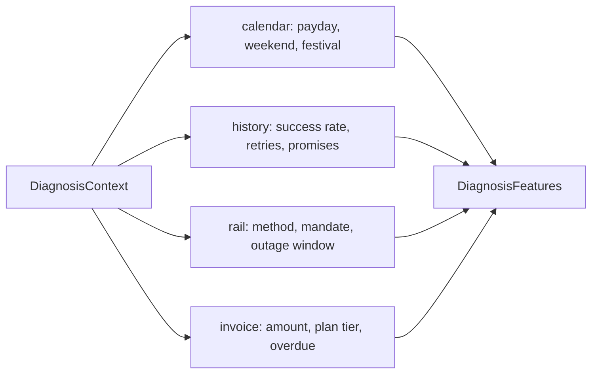
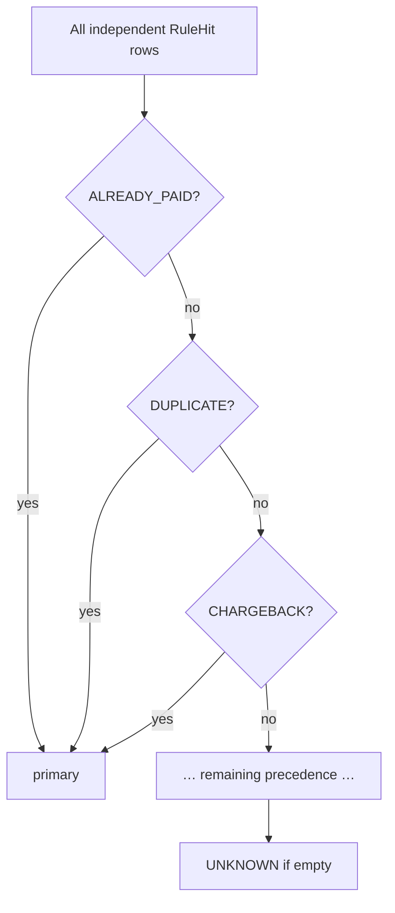
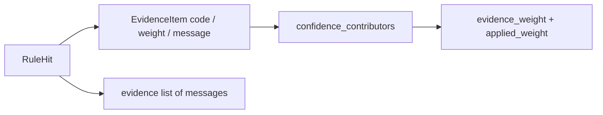
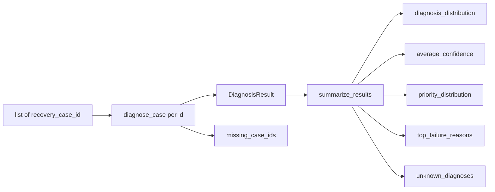

# Diagnosis engine — Phase 5A

Deterministic, explainable diagnosis for RecoveryPilot AI. The engine
answers **why a payment failed** and returns a structured `DiagnosisResult`.
It does **not** call Gemini, Razorpay, or any ML model. It does **not** write
to PostgreSQL, schedule retries, or apply policy.

Package: `services/src/services/diagnosis/`
Service: `services/src/services/diagnosis_service.py`

---

## Diagnosis pipeline

```mermaid
flowchart TD
    IN[Recovery case id or payment] --> SVC[diagnosis_service load snapshots]
    SVC --> CTX[DiagnosisContext]
    CTX --> FEAT[extract_features]
    FEAT --> FV[DiagnosisFeatures]
    FV --> RULES[independent rules]
    RULES --> HITS[RuleHit list]
    HITS --> PICK[precedence: one primary diagnosis]
    PICK --> CONF[score_confidence 0..1]
    PICK --> PRI[score_priority 0..100]
    HITS --> EV[evidence list[str] + evidence_items]
    CONF --> OUT[DiagnosisResult]
    PRI --> OUT
    EV --> OUT
```

`recommended_action_placeholder` is informational (`WAIT_FOR_PAYDAY`,
`RETRY_PAYMENT`, `STOP_RECOVERY`, …). Nothing is executed.

---

## Feature extraction flow



| Feature | Source |
| --- | --- |
| `days_since_failure` | `as_of` − payment `created_at` (IST) |
| `days_until_payday` | Days until next 1st (payday window is 1st–5th) |
| `retry_count` | `attempt_number − 1` plus recovery actions |
| `payment_method` | Payment rail |
| `customer_segment` | Customer row |
| `mandate_status` | Subscription |
| `subscription_plan` / tier | Plan name or billing paise |
| `payment_amount` | Integer paise |
| `outage_detected` | Injected or `outage_events.json` windows |
| `previous_success_rate` | Prior customer payments |
| `promise_pending` | Open promise-to-pay |
| `weekend_payment` | Sat/Sun in IST |
| `festival_period` | Static 2026 Indian festival calendar |
| `salary_dependent` | Snapshot flag or AT_RISK / CHURN_RISK proxy |

Salary-dependent is **not** a Postgres column. The service infers it from
segment; tests and callers may set it explicitly on `CustomerSnapshot`.

Outage windows are optional. When diagnosing from the database the service
reads `simulator/output/outage_events.json` if present. Tests inject
`OutageWindow` objects. The engine never imports the simulator package.

---

## Rule evaluation order

Every rule is an independent function in `rules.py`. All rules run. Hits
become `triggered_rules` and `evidence`. **Exactly one** primary diagnosis
is chosen by precedence (first match in this list wins):

1. `ALREADY_PAID` — later successful payment on the same invoice
2. `DUPLICATE_PAYMENT` — capture in a 48-hour duplicate window
3. `CHARGEBACK_ACTIVE` — dispute failure reason
4. `CUSTOMER_CANCELLED` — cancelled subscription or recorded reason
5. `MANDATE_REVOKED` — mandate revoked / expired
6. `CARD_EXPIRED` — card expiry signal
7. `BANK_TIMEOUT` — bank/card/netbanking outage (or recorded timeout)
8. `UPI_TIMEOUT` — UPI rail outage (maps NPCI `UPI_FAILURE` windows)
9. `AUTHENTICATION_FAILED` — UPI failure with **no** outage
10. `INSUFFICIENT_FUNDS` — NSF and/or pre-payday salary cycle
11. `UNKNOWN` — no rule fired



---

## Confidence scoring methodology

Score is a weighted sum, clamped to `[0.05, 0.99]`.

| Contributor | Weight | When it applies |
| --- | --- | --- |
| base | 0.20 | always |
| matching rule | 0.35 × rule weight | rule diagnosis = primary |
| recorded failure reason | 0.28 | DB `failure_reason` maps to primary |
| outage match | 0.22 | timeout diagnoses with a live window |
| customer history | 0.12 | NSF with prior success rate ≥ 0.5 |
| payment retries | 0.08 | auth / timeout with retries |
| mandate state | 0.10 | revoked/expired diagnoses |
| salary cycle | 0.10 | NSF on a salary-dependent customer |

Each term is listed on `DiagnosisResult.confidence_contributors`.

---

## Evidence format

Every diagnosis carries **two** evidence views. The public service methods
(`diagnose_case`, `diagnose_payment`, `diagnose_batch`) are unchanged.

### Human-readable list (existing)

`DiagnosisResult.evidence: list[str]` — one sentence per bullet. Callers that
already render this list keep working.

```
Diagnosis: INSUFFICIENT_FUNDS
Evidence:
  - Salary-dependent customer.
  - Failure occurred on day 30 (pre-payday squeeze).
  - Salary expected in 2 day(s).
  - 2 previous successful payment(s) on file.
```

### Structured evidence objects (additive)

`DiagnosisResult.evidence_items: list[EvidenceItem]`

| Field | Type | Meaning |
| --- | --- | --- |
| `code` | string | Stable identifier (not a diagnosis category) |
| `weight` | float 0–1 | Raw evidence weight used in confidence |
| `message` | string | Same sentence as the human-readable list |

```json
{
  "code": "SALARY_DEPENDENT",
  "weight": 0.1671,
  "message": "Salary-dependent customer."
}
```

NSF salary-cycle cases emit several items (`SALARY_DEPENDENT`,
`PRE_PAYDAY_WINDOW`, `DAYS_UNTIL_PAYDAY`, `PRIOR_SUCCESS`, and optionally
`RECORDED_INSUFFICIENT_FUNDS`). Other rules emit one item whose `code` is the
uppercase `rule_id`. Item weights for a matching rule **sum to that rule's
weight**, so confidence stays on the same scale.



### Confidence output

`ConfidenceContributor` now includes the evidence weight used in the sum:

| Field | Meaning |
| --- | --- |
| `label` | Existing label (`base`, `outage_match`, `rule:…`, `evidence:…`) |
| `code` | Evidence or corroboration code |
| `weight` | Term weight (rule evidence weight or corroboration constant) |
| `message` | Human-readable explanation |
| `evidence_weight` | Raw evidence weight (same as `EvidenceItem.weight` for rule terms) |
| `applied_weight` | Amount added to the pre-clamp confidence sum (`evidence_weight × 0.35` for rule items) |

Rule evidence is applied as `applied_weight = evidence_weight × 0.35`
(`RULE_EVIDENCE_SCALE`). Corroborating signals (`recorded_failure_reason`,
`outage_match`, `customer_history`, `payment_retries`, `mandate_state`,
`salary_cycle`) keep their documented constants as both `evidence_weight`
and `applied_weight`.

---

## Priority scoring methodology

Separate from confidence. Range **0–100**.

| Factor | Points |
| --- | --- |
| Amount | up to 30 (scaled by paise) |
| Customer segment | HIGH_VALUE 25 … NEW 8 |
| Days overdue | 2 per day, cap 20 |
| Retry count | 3 per retry, cap 10 |
| Subscription tier | Premium 10 … Starter 2 |
| Open promise | +8 |
| Prior success rate ≥ 0.4 | +5 |

Buckets: **HIGH** ≥ 70, **MEDIUM** ≥ 40, **LOW** otherwise.

---

## Supported diagnoses

| Diagnosis | Typical evidence | Placeholder action |
| --- | --- | --- |
| `INSUFFICIENT_FUNDS` | NSF + pre-payday salary cycle | `WAIT_FOR_PAYDAY` |
| `BANK_TIMEOUT` | SBI/HDFC/Axis window | `RETRY_PAYMENT` |
| `UPI_TIMEOUT` | NPCI UPI window | `RETRY_PAYMENT` |
| `CARD_EXPIRED` | Card expiry / expired card mandate | `SWITCH_PAYMENT_METHOD` |
| `AUTHENTICATION_FAILED` | UPI failure, no outage | `GENERATE_PAYMENT_LINK` |
| `MANDATE_REVOKED` | Mandate revoked | `STOP_RECOVERY` |
| `CUSTOMER_CANCELLED` | Subscription cancelled | `STOP_RECOVERY` |
| `DUPLICATE_PAYMENT` | Twin capture in 48h | `NO_ACTION` |
| `CHARGEBACK_ACTIVE` | Dispute | `ESCALATE_TO_AGENT` |
| `ALREADY_PAID` | Later capture | `NO_ACTION` |
| `UNKNOWN` | No rule fired | `ESCALATE_TO_AGENT` |

`diagnosis_model` = `recovery_diagnosis_v1`, `diagnosis_version` = `1.0.0`.

---

## Explainability example

```
Diagnosis: INSUFFICIENT_FUNDS
Confidence: 0.82
Priority: 61 MEDIUM
Triggered rules: insufficient_funds
Evidence:
  - Salary-dependent customer.
  - Failure occurred on day 30 (pre-payday squeeze).
  - Salary expected in 2 day(s).
  - 2 previous successful payment(s) on file.
Evidence items:
  - SALARY_DEPENDENT weight=0.17 "Salary-dependent customer."
  - PRE_PAYDAY_WINDOW weight=0.18 "Failure occurred on day 30 (pre-payday squeeze)."
  - DAYS_UNTIL_PAYDAY weight=0.15 "Salary expected in 2 day(s)."
  - PRIOR_SUCCESS weight=0.14 "2 previous successful payment(s) on file."
Confidence contributors include evidence_weight and applied_weight for each term.
Recommended action (not executed): WAIT_FOR_PAYDAY
```

---

## Batch diagnosis architecture



`diagnose_batch` does not abort on a missing id. It records `missing_case_ids`
and still returns a summary over successful diagnoses.

Public methods on `diagnosis_service`:

- `diagnose_case(db, recovery_case_id)`
- `diagnose_payment(db, payment_id)`
- `diagnose_batch(db, recovery_case_ids)`
- `summarize_results(results)` — no database

---

## Constraints

- No Gemini / LLM / ML.
- No Razorpay HTTP.
- No `UPDATE` / `INSERT` on diagnosis fields.
- No scheduler, no policy engine.
- Routers and existing APIs are unchanged in this phase.
