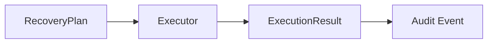
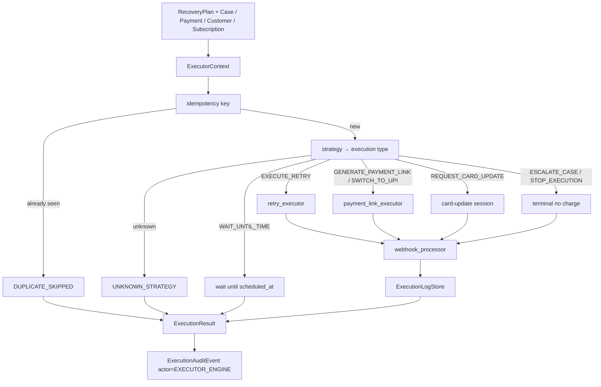
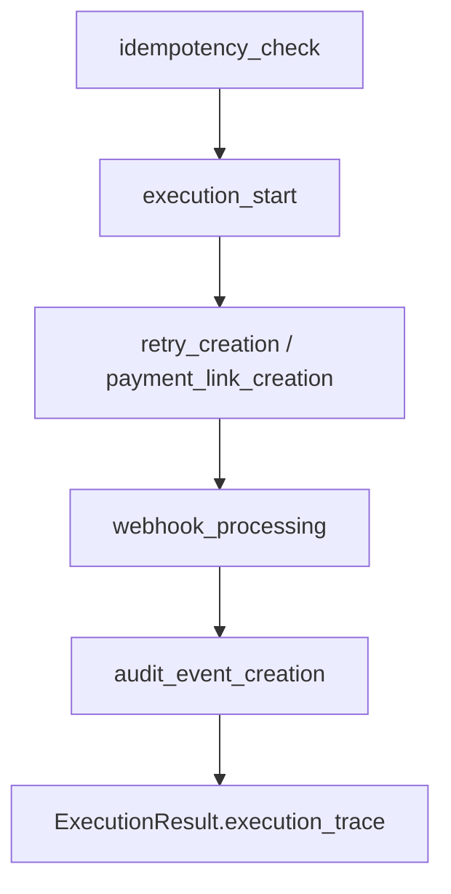
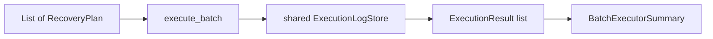

# Executor engine — Phase 6A

Deterministic recovery executor for RecoveryPilot AI. The engine consumes a
**RecoveryPlan** plus read-only case snapshots and produces an
`ExecutionResult`. It **simulates** Razorpay retries, webhooks, payment links,
and card-update sessions.

It does **not** call Razorpay APIs, Gemini, or any ML model. It does **not**
send SMS, WhatsApp, Email, or Voice. It does **not** write to PostgreSQL
(`audit_logs` / `webhook_events` stay unchanged). Planner, policy, and
diagnosis outputs are never mutated.

Package: `services/src/services/executor/`
Service: `services/src/services/executor_service.py`

`executor_version` is always `recovery_executor_v1`.

---

## Execution pipeline





Exactly **one** execution type per RecoveryPlan.

| Planner strategy | Execution type |
| --- | --- |
| `RETRY_PAYMENT`, `RETRY_SILENTLY` | `EXECUTE_RETRY` |
| `SEND_PAYMENT_LINK` | `GENERATE_PAYMENT_LINK` |
| `SWITCH_PAYMENT_METHOD` | `SWITCH_TO_UPI` |
| `REQUEST_NEW_MANDATE` | `REQUEST_CARD_UPDATE` |
| `WAIT_FOR_PAYDAY`, `HONOUR_PROMISE_TO_PAY` | `WAIT_UNTIL_TIME` |
| `ESCALATE_TO_HUMAN` | `ESCALATE_CASE` |
| `STOP_RECOVERY` | `STOP_EXECUTION` |

`execute_plan` / `execute_case` load snapshots when a DB session is provided.
Loads are read-only. Missing cases return `outcome = CASE_NOT_FOUND` instead
of raising.

---

## Execution lifecycle

Every `ExecutionResult` includes `execution_trace`: an ordered list of
`ExecutionTraceStep` rows (`step`, `timestamp`, `status`, `detail`).



| Step | When |
| --- | --- |
| `idempotency_check` | After the key is computed. `SUCCEEDED` on a new key, `DUPLICATE_SKIPPED` on a hit. |
| `execution_start` | After the strategy maps to an execution type. `SKIPPED` on duplicates. |
| `retry_creation` | Simulated charge retry (`EXECUTE_RETRY`). |
| `payment_link_creation` | Hosted link (`GENERATE_PAYMENT_LINK` / `SWITCH_TO_UPI`). |
| `webhook_processing` | After simulated Razorpay events. `SKIPPED` when none are emitted. |
| `audit_event_creation` | Always last. In-memory `ExecutionAuditEvent` was written. |

Other execution types use the same skeleton with `card_update_creation`,
`wait_scheduled`, or `terminal_action` in place of retry/link creation.

Duplicate runs still emit all five core steps: the action and webhook steps
are `SKIPPED`; only a skip audit is recorded. Timestamps use the simulation
clock (`as_of`).

---

## Idempotency flow

Every execution builds:

```
exec:{recovery_case_id}:{strategy}:{scheduled_at.isoformat()}
```

The same case + strategy + scheduled time always produces the same key and the
same `uuid5` `execution_id`.

1. Compute the key.
2. If `ExecutionLogStore` already has it, return `status = DUPLICATE_SKIPPED`.
   Side effects (retry, link, webhooks) do **not** run again.
3. Otherwise execute once, persist the result, emit an audit event.

`idempotent` is `false` on the first run and `true` on the skip.

---

## Webhook replay flow

The processor emits normalized `SimulatedWebhookEvent` rows. Supported types:

- `payment.authorized`
- `payment.captured`
- `payment.failed`
- `subscription.charged`
- `subscription.pending`
- `subscription.halted`
- `payment_link.paid`

Event ids are stable (`evt_…`) from case + scheduled time + event type. The
in-memory store records ids it has already seen. A second delivery of the
same id sets `replay = true`. If every webhook on a new execution is a
replay, the result status is `WEBHOOK_REPLAY` and recovered value is 0.

Nothing is inserted into `webhook_events`.

---

## Payment link lifecycle

`GENERATE_PAYMENT_LINK` and `SWITCH_TO_UPI` call `payment_link_executor`.

1. Deterministic `plink_…` id from case + scheduled time.
2. `expires_at = scheduled_at + 48 hours`.
3. `payment_method`, `merchant_reference`, `status = GENERATED`.
4. If `as_of >= expires_at`, status is `EXPIRED` (no charge).
5. High planner probability (`>= 0.85`) may also simulate `payment_link.paid`.

`SWITCH_TO_UPI` uses UPI as the advertised method. No Razorpay HTTP.

---

## Retry lifecycle

`EXECUTE_RETRY` calls `retry_executor`. Outcomes are copied from the simulator
mix (no simulator import):

| Outcome | Typical webhooks |
| --- | --- |
| `SUCCESS` | `payment.authorized`, `payment.captured`, `subscription.charged` |
| `FAILED` / `NSF` / `AUTH_FAILURE` | `payment.failed` |
| `BANK_TIMEOUT` | `payment.failed`, result status `TIMEOUT` |

Determinism:

- Planner probability `>= 0.85` → `SUCCESS`.
- Planner probability `<= 0.12` → a failure class (never `SUCCESS`).
- Mid-range → `sha256` bucket over the copied mix.

`RETRY_SILENTLY` uses the same charge simulation; metadata records `silent`.

---

## Card-update session

`REQUEST_CARD_UPDATE` generates `cs_…`, a 24-hour expiry, and `status = CREATED`
(or `EXPIRED` when the clock is past TTL). A `subscription.pending` webhook is
simulated. No Razorpay checkout.

---

## Execution audit

Every execution (including duplicates) produces an in-memory
`ExecutionAuditEvent`:

| Field | Value |
| --- | --- |
| `actor` | `EXECUTOR_ENGINE` |
| `action` | execution type or `DUPLICATE_SKIPPED` |
| `outcome` | simulated outcome |
| `request_id` | `execution_id` |
| `correlation_id` | recovery case id |
| `idempotency_key` | stable `exec:…` key |
| `timestamp` | `executed_at` / `as_of` |

`ActorType` in `shared.enums` is **not** extended. No `audit_logs` INSERT.

---

## Batch executor architecture

`execute_batch(plans, as_of=…)` runs each plan against a **shared**
`ExecutionLogStore`.



Summary fields:

- `executed` — results that are not `DUPLICATE_SKIPPED`
- `successes` / `failures` / `duplicates`
- `payment_links_generated`
- `retries_scheduled`
- `estimated_recovered_value` (paise; duplicates contribute 0)

---

## Failure handling

`execute()` never raises a raw exception. Structured statuses include:

| Status | When |
| --- | --- |
| `DUPLICATE_SKIPPED` | idempotency hit |
| `EXPIRED` | payment link or card session TTL elapsed |
| `WEBHOOK_REPLAY` | all simulated webhooks already seen |
| `TIMEOUT` | retry `BANK_TIMEOUT` |
| `UNKNOWN_STRATEGY` | no mapping for the planner strategy |
| `FAILED` | retry miss, missing case, or caught internal error |

Explainability on every `ExecutionResult`: `execution_reason`,
`planner_strategy`, `policy_decision`, `diagnosis`, `idempotent`,
`human_summary`, and `execution_trace`.

---

## Constraints

- No Razorpay, Gemini, or communications.
- No schema or API changes.
- Planner / policy / diagnosis engines are unchanged.
- Money remains integer paise.
- Execution log is process-local memory only.
