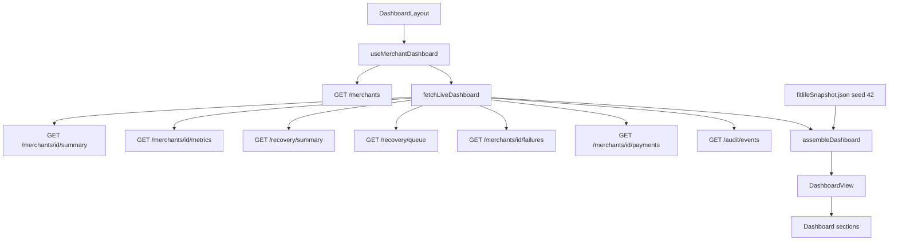

# Merchant dashboard — Phase 8A

React operations console for FitLife Gym. Backend APIs, Gemini, planner,
executor, simulator, schema, and tests are unchanged. This app is UI only.

Package: `apps/frontend`

---

## Component hierarchy

```
App
  QueryClientProvider
    BrowserRouter
      DashboardLayout
        AppShell
          Sidebar
          TopNavbar
          Outlet
            Dashboard
              HeroKpiRow → StatCard
              AiInsightsPanel → InsightCard (horizontal carousel)
              RecoveryFunnelChart | FailureReasonsChart
              RevenueTrendChart (area + daily recoveries line)
              AiLiftCard | RecoveryHealthPanel
              RecentActivity → TimelineItem
              TopCustomersTable
            ComingSoonPage (queue / analytics / audit / simulator)
```

Shared primitives live under `src/components/shared/`: `StatCard`,
`SectionHeader`, `StatusBadge`, `PriorityBadge`, `InsightCard`,
`TimelineItem`, `ChartCard`, `LoadingSkeleton`, `EmptyState`.

---

## Layout

```
┌──────────┬─────────────────────────────────────┐
│ Sidebar  │ TopNavbar (merchant, env, sync)     │
│ Dashboard│ KPIs                                │
│ Queue    │ AI Insights carousel                │
│ Analytics│ Funnel | Failures                   │
│ Audit    │ Revenue + daily recoveries          │
│ Simulator│ AI lift | Health grid               │
│ Settings │ Activity feed | Top 5 customers     │
└──────────┴─────────────────────────────────────┘
```

Desktop-first. Insights sit in a horizontal carousel under the KPI row.
Sidebar collapses to icon rail. Settings is disabled. Recovery Queue,
Analytics, Audit, and Simulator routes are placeholders only.

---

## State flow



TanStack Query owns fetch/cache. `trendRange` (7 / 30) is local React state
and only slices the already-loaded series.

---

## API flow

Base URL: `import.meta.env.VITE_API_BASE_URL` or `/api/v1` (Vite proxies
`/api` → `http://localhost:8000`). No production hosts are hardcoded.

| Call | Used for |
| --- | --- |
| `GET /merchants` | Merchant selector (FitLife Gym default) |
| `GET /merchants/{id}/summary` | Profile + ledger counts |
| `GET /merchants/{id}/metrics` | KPI paise / recovery rate |
| `GET /recovery/summary` | Waiting / recovered / stopped / escalated |
| `GET /recovery/queue` | Top customers at risk |
| `GET /merchants/{id}/failures` | Failure donut (when the page is populated) |
| `GET /merchants/{id}/payments` | Trend overlay (when the ledger is populated) |
| `GET /audit/events` | Activity timeline |

There is no explanations HTTP API. Insight cards use the Gemini
`DashboardSummary` shape (`title`, `summary` ≤160 chars, `risk_level`,
`next_action`, `source`, `cached`, `generated_at`) and are derived locally
from KPIs with `source: "fallback"`.

If every live request fails, the UI shows an error + retry and still
renders the seed-42 snapshot so the console is never blank. If the API
responds with empty metrics (unseeded DB), the snapshot is used. Live
rows win when recovered revenue or queue items are present.

`simulator/output/` is empty in this workspace. The snapshot is the
in-memory `build_ecosystem(seed=42)` result: same formulas as
`simulator/src/simulator/event_generator.py`.

---

## Theme tokens

Defined in `src/index.css` `@theme` and consumed as Tailwind utilities
(`bg-surface`, `text-recovered`) or CSS variables in Recharts
(`var(--color-recovered)`).

| Token | Role |
| --- | --- |
| `--color-canvas` / `--color-surface` | Slate/zinc dark shell |
| `--color-recovered` | Recovered revenue |
| `--color-waiting` | Waiting / pending |
| `--color-blocked` | Stopped / escalated |
| `--color-ai` | Insights / lift |
| `--color-info` | Informational metrics |

Cards are `rounded-xl`. Motion is Framer Motion ≤200ms (fade, hover lift,
KPI count-up). `prefers-reduced-motion` disables transitions.

---

## Snapshot KPIs (FitLife, seed 42)

Amounts are integer paise.

| Metric | Value |
| --- | ---: |
| Revenue at risk | ₹8,42,250 |
| Recovered by AI | ₹5,83,495 |
| Recovery rate | 69.3% |
| Baseline recovered | ₹2,86,749 |
| Extra revenue | ₹2,96,746 |
| Harmful retries prevented | 117 |
| Cases waiting | 48 |
| Pending recovery | ₹48,952 |

---

## Accessibility

- Skip link to main content
- Sidebar collapse control has `aria-expanded`
- Active route via React Router `NavLink`
- Table rows are keyboard-activatable (`Enter` / `Space`)
- Form controls have labels (visible or `sr-only`)
- Contrast uses tokenized light-on-dark pairing (AA for body/KPI text)
- Responsive from ~768px tablet to 1440px+ desktop
