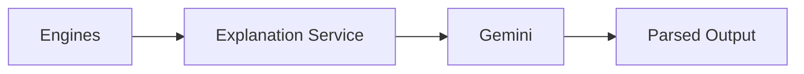
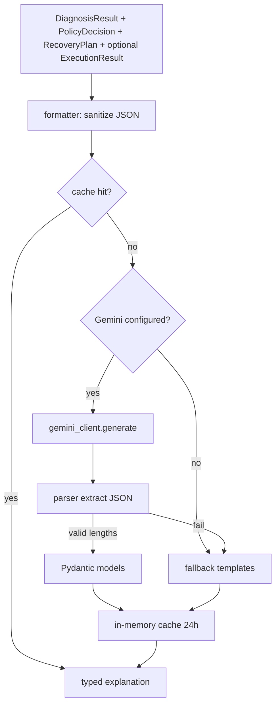

# Gemini explanation agent — Phase 7

Gemini turns **deterministic engine outputs** into human-readable copy.
It **never** chooses a recovery action, channel, retry time, or policy
decision. Diagnosis, policy, planner, executor, simulator, schema, APIs,
and audit are unchanged.

Package: `integrations/src/integrations/gemini/`
Service: `services/src/services/explanations/`

---

## Architecture





Routers are not added in this phase. Callers use
`explain_merchant`, `explain_customer_*`, `explain_compliance`,
`explain_dashboard`, and `generate_batch_summaries`.

Gemini configuration is loaded with existing `Settings()`:

| Setting | Env | Default |
| --- | --- | --- |
| `gemini_api_key` | `GEMINI_API_KEY` | placeholder (treated as unconfigured) |
| `gemini_model` | `GEMINI_MODEL` | `gemini-2.5-flash` |
| `gemini_temperature` | | `0.2` |
| `gemini_max_output_tokens` | | `512` |

No API keys are hardcoded. Placeholder keys skip HTTP and use fallbacks.

---

## Prompt flow

1. Build `ExplanationContext` from engine objects (never ORM rows).
2. `formatter.py` keeps only structured, non-secret fields.
3. `prompts.py` wraps that JSON with instructions:
   - Do not invent payment information.
   - Use only the provided JSON.
   - If a field is missing, say so.
   - Do not decide recovery actions.
4. `GeminiClient.generate` posts to `generateContent`.
5. `parser.py` extracts a JSON object (markdown fences allowed).
6. Pydantic validates the typed result. Length guards reject over-long text.

---

## Cache flow

Key:

```
{case_id}:{explanation_type}:{planner_version}:{policy_version}
```

TTL **24 hours**, process-local (`ExplanationCache`). A hit returns the
stored explanation with `cached = true` and does **not** call Gemini.
`generate_batch_summaries` shares the cache across dashboard cards.

---

## Metadata format

Every explanation object includes both top-level provenance fields and a
nested `metadata` object. They stay in sync.

```json
{
  "source": "gemini",
  "cached": false,
  "generated_at": "2026-09-04T12:00:00+00:00",
  "prompt_version": "explanation_prompt_v1",
  "metadata": {
    "source": "gemini",
    "cached": false,
    "generated_at": "2026-09-04T12:00:00+00:00",
    "prompt_version": "explanation_prompt_v1"
  }
}
```

| Field | Values |
| --- | --- |
| `source` | `gemini` or `fallback` |
| `cached` | `true` on a cache hit, else `false` |
| `generated_at` | UTC timestamp of the original generation |
| `prompt_version` | `explanation_prompt_v1` |

Merchant copy always ends with this disclaimer (appended after Gemini or
the local template, never invented as a recovery decision):

> Based on payment history and RecoveryPilot policy evaluation.

---

## Hallucination safeguards

Before the prompt is sent:

- Drop keys that look like secrets (`api_key`, tokens, `idempotency_key`).
- Drop internal ids (`payment_id`, `recovery_case_id`, UUIDs, `*_id`).
- Keep only a given **first name**; emails and phone-like tokens are removed.
- Do not send confidence scores, raw feature maps, or API keys.

After Gemini replies:

- Parse JSON; on failure use the local template.
- Enforce length caps (merchant 40–800 chars and 2–4 sentences, SMS 320,
  WhatsApp 1024, dashboard summary 160).
- **Compliance** structured fields (`diagnosis`, `evidence`,
  `triggered_policies`, `blocked_policies`, `planner_strategy`,
  `execution_outcome`) are always copied from the engines. Gemini may only
  rewrite the narrative paragraph.
- **Dashboard** `risk_level` and `next_action` always come from
  `priority_bucket` and the planner strategy.

---

## Fallback flow

If the key is a placeholder, HTTP fails, JSON is invalid, or length checks
fail, `fallback.py` builds the same typed models from templates. No network.
Examples exist for merchant, WhatsApp/SMS/Email, compliance, and dashboard.

Customer Hinglish is a **placeholder string** with `{first_name}`,
`{amount_rupees}`, `{merchant}`, and `{payment_link}` — not a live send.

---

## Explanation types

| Mode | Output |
| --- | --- |
| Merchant | 2–4 sentence why / strategy / expected outcome, plus confidence disclaimer |
| Customer WhatsApp / SMS / Email | English body + Hinglish template |
| Compliance | Factual audit narrative + engine fields |
| Dashboard | `title`, `summary` (≤160 chars), `risk_level`, `next_action` |

---

## Constraints

- Gemini does not call Razorpay or send SMS / WhatsApp / Email / Voice.
- Planner, policy, and diagnosis outputs are not modified.
- Money remains integer paise in the engines; customer copy may show rupees
  as display formatting (`paise // 100`).
- No schema or HTTP API changes in this phase.
