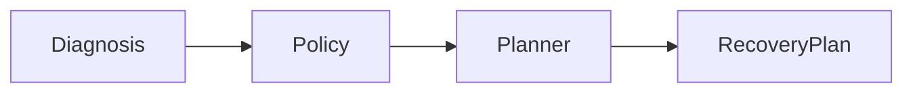
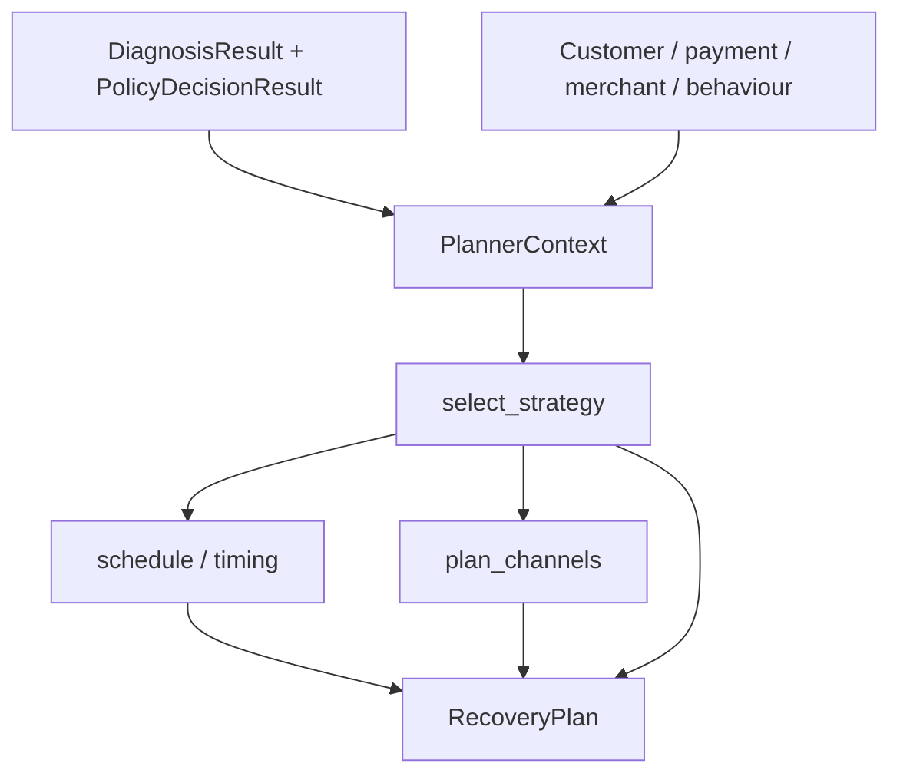
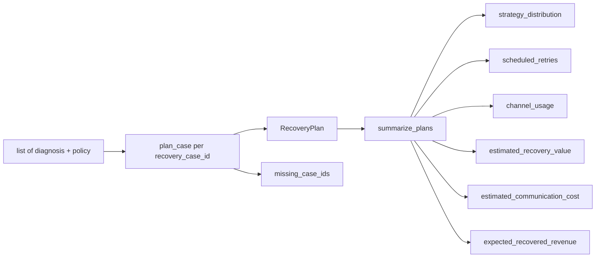

# Planner engine — Phase 5C

Deterministic recovery planner for RecoveryPilot AI. The engine converts
**DiagnosisResult + PolicyDecision + customer context** into a
`RecoveryPlan`. It does **not** call Gemini, Razorpay, or any ML model. It
does **not** write to PostgreSQL, send messages, or execute retries.

Package: `services/src/services/planner/`
Service: `services/src/services/planner_service.py`

Diagnosis engine, policy engine, simulator, schema, and existing APIs are
unchanged.

---

## Planner architecture





`plan_case` may call `diagnose_case` and `evaluate_case` when those results
are omitted. Both calls are read-only.

---

## Strategy decision matrix

Exactly one primary strategy. Policy gates run first.

| Diagnosis | Policy | Strategy |
| --- | --- | --- |
| any | `STOP` | `STOP_RECOVERY` |
| any | `DENY` | `STOP_RECOVERY` |
| any | `ESCALATE` | `ESCALATE_TO_HUMAN` |
| (promise active) | `WAIT` | `HONOUR_PROMISE_TO_PAY` |
| `BANK_TIMEOUT` / `UPI_TIMEOUT` | `WAIT` | `RETRY_SILENTLY` |
| `INSUFFICIENT_FUNDS` | `WAIT` | `WAIT_FOR_PAYDAY` |
| `CARD_EXPIRED` | `ALLOW` | `REQUEST_NEW_MANDATE` |
| `AUTHENTICATION_FAILED` | `ALLOW` | `SWITCH_PAYMENT_METHOD` |
| `INSUFFICIENT_FUNDS` | `ALLOW` | `SEND_PAYMENT_LINK` |
| `ALREADY_PAID` | `STOP` | `STOP_RECOVERY` |
| `CHARGEBACK_ACTIVE` | `ESCALATE` | `ESCALATE_TO_HUMAN` |

`WAIT` with only a retry cooldown (no NSF / outage / promise) maps to
`RETRY_PAYMENT` after `cooldown_until`.

---

## Timing engine rules

Implemented in `timing.py` and `scheduler.py`. Timezone default
`Asia/Kolkata`.

| Strategy | `scheduled_at` |
| --- | --- |
| `WAIT_FOR_PAYDAY` | Next 09:15 on a payday day (1st–5th), after policy cooldown, then next business window |
| `RETRY_SILENTLY` | 60 minutes after outage end (inside the 30–90 minute band) |
| `HONOUR_PROMISE_TO_PAY` | Exactly on the promised date at 09:15 (date is not moved) |
| Others | `max(as_of, cooldown_until)` inside 08:00–19:00 weekdays |
| `STOP_RECOVERY` | `as_of`, no window |

Weekend and 2026 festival dates (same calendar as diagnosis, no simulator
import) push retries to the next weekday 09:15, except promise dates.

Policy `cooldown_until` is always respected (`scheduled_at >= cooldown`).

Example: cooldown expires Sept 1 21:00 and the customer is salary-dependent
→ wait until **Sept 2 09:15** (still inside the 1st–5th payday window,
09:00–11:00 IST).

`retry_window` and optional `expires_at` are attached to the plan.

---

## Channel ranking rules

Possible channels: `SMS`, `WhatsApp`, `Email`, `Voice`, `UPI_PAYMENT_LINK`,
`CARD_UPDATE_LINK`, `DASHBOARD_NOTIFICATION`.

1. Start from `PolicyDecision.allowed_channels`.
2. Never pick `blocked_channels`.
3. `RETRY_SILENTLY` / `STOP_RECOVERY` → dashboard only (no customer notify).
4. Rank remaining by **effectiveness − cost/10**.
5. Dashboard is always allowed (merchant-facing).

Unit costs (simulator, integer **paise**):

| Channel | Cost |
| --- | --- |
| SMS | 15 (₹0.15) |
| WhatsApp | 80 (₹0.80) |
| Voice | 250 (₹2.50) |
| Email / dashboard / UPI link / card-update link | 0 |

`estimated_cost` is the sum of recommended channel unit costs.

---

## Fallback strategy logic

Every plan has exactly one `fallback_strategy`.

| Primary | Fallback |
| --- | --- |
| `WAIT_FOR_PAYDAY` | `SEND_PAYMENT_LINK` |
| `RETRY_SILENTLY` | `SWITCH_PAYMENT_METHOD` |
| `REQUEST_NEW_MANDATE` | `ESCALATE_TO_HUMAN` |
| `SWITCH_PAYMENT_METHOD` | `SEND_PAYMENT_LINK` |
| `SEND_PAYMENT_LINK` | `ESCALATE_TO_HUMAN` |
| `RETRY_PAYMENT` | `SEND_PAYMENT_LINK` |
| `HONOUR_PROMISE_TO_PAY` | `SEND_PAYMENT_LINK` |
| `ESCALATE_TO_HUMAN` | `STOP_RECOVERY` |
| `STOP_RECOVERY` | `STOP_RECOVERY` |

---

## Recovery probability

Deterministic weighted sum, clamped to `[0.05, 0.95]` (0.0 for stop):

- 0.40 × diagnosis confidence
- 0.16 × previous success rate
- +0.10 salary-dependent payday wait
- segment bonus (HIGH_VALUE 0.12 … CHURN_RISK 0)
- −0.08 × retries/3
- +0.05 if subscription age ≥ 90 days

`estimated_recovery_value` = `payment_amount × probability` (integer paise).

---

## Strategy confidence methodology

`strategy_confidence` is **how sure the planner is that this is the right
strategy**. It is not `expected_recovery_probability` (chance of collecting
money). Range `[0.05, 0.99]`. No ML.

Weighted sum:

| Signal | Weight | Source |
| --- | --- | --- |
| Diagnosis confidence | 0.35 | `DiagnosisResult.confidence` |
| Policy decision strength | 0.30 | Gate conclusiveness (below) |
| Customer payment history | 0.20 | `previous_success_rate` |
| Timing certainty | 0.15 | How fixed `scheduled_at` is |

Policy decision strength (how conclusive the gate is):

| Decision | Strength |
| --- | --- |
| `STOP` | 0.95 |
| `ESCALATE` | 0.88 |
| `DENY` | 0.85 |
| `WAIT` | 0.80 (+0.05 when `cooldown_until` is set) |
| `ALLOW` | 0.74 |

Timing certainty examples: stop is immediate (0.98); promised date is exact
(0.92); payday 09:15 IST (0.88); known outage end + 60 minutes (0.86);
cooldown-anchored window (0.80); inferred outage end (0.58).

`confidence_reasoning` states why this strategy was selected and quotes the
four inputs, for example:

```
INSUFFICIENT_FUNDS + WAIT → WAIT_FOR_PAYDAY. Strategy confidence 0.81 from
diagnosis 0.80, policy WAIT strength 0.85, prior success rate 70%, and
timing certainty 0.88 (payday 09:15 IST slot is fixed).
```

`plan_case` / `plan_batch` signatures are unchanged. These fields are additive
on `RecoveryPlan`.

---

## RecoveryPlan fields

| Field | Meaning |
| --- | --- |
| `strategy` | Primary strategy |
| `scheduled_at` | When to act |
| `reasoning` | Human-readable summary |
| `recommended_channels` | Ranked, policy-filtered |
| `fallback_strategy` | Always present |
| `expected_outcome` | One-line expected result |
| `expected_recovery_probability` | 0–1 chance of collecting |
| `strategy_confidence` | 0–1 confidence this is the right strategy |
| `confidence_reasoning` | Why this strategy was selected |
| `estimated_recovery_value` | Paise |
| `estimated_cost` | Comms cost, paise |
| `plan_version` | `recovery_planner_v1` |
| `planner_version` | `1.0.0` |
| `generated_at` | UTC |
| `reasoning_steps` | Strategy selection notes |
| `evidence_codes_used` | Diagnosis + policy codes |
| `policy_rules_used` | Triggered policy names |
| `timing_reason` / `channel_reason` | Explainability |

Example:

```
Wait until Sept 2 09:15 because customer historically pays within 24h of
salary credit and retry cooldown expires Sept 1 21:00.
```

---

## Batch planner pipeline



Public methods on `planner_service`:

- `plan_case(db, recovery_case_id, diagnosis=None, policy=None)`
- `plan_batch(db, items)` — `items` is `list[PlannerPair]`
- `summarize_plans(results)` — no database

`scheduled_retries` counts `WAIT_FOR_PAYDAY`, `RETRY_PAYMENT`, and
`RETRY_SILENTLY`.

---

## Constraints

- No Gemini / LLM / ML.
- No Razorpay HTTP.
- No `UPDATE` / `INSERT`.
- No message send, no retry execution, no job scheduler.
- Diagnosis, policy, simulator, schema, and existing APIs are unchanged.
