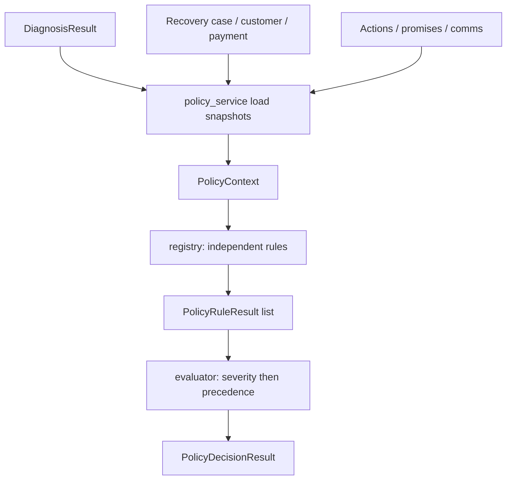
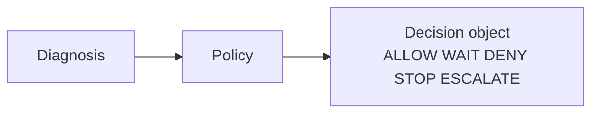
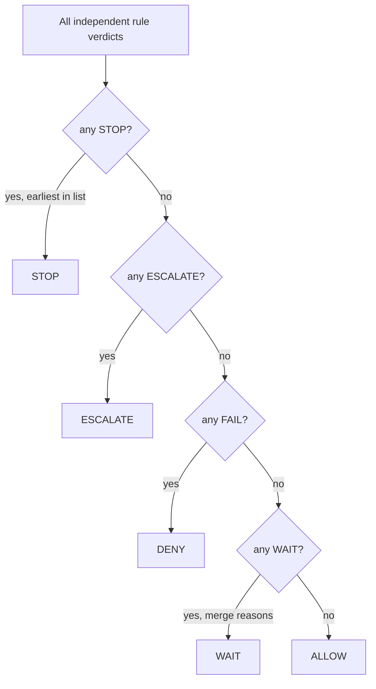
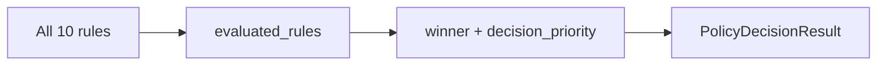
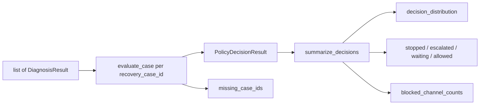

# Policy engine — Phase 5B

Deterministic compliance gate for RecoveryPilot AI. The engine answers
**whether RecoveryPilot is allowed to act**. It does **not** choose the
action (that is the Phase 5C planner). It does **not** call Gemini, Razorpay,
or any ML model. It does **not** write to PostgreSQL, schedule retries, or
generate payment links.

Package: `services/src/services/policy/`
Service: `services/src/services/policy_service.py`

The audit-log enum `shared.enums.PolicyDecision` (`ALLOW` / `BLOCK` /
`ESCALATE`) is unchanged. This engine uses a richer decision set.

---

## Policy evaluation pipeline





`evaluate_case` may call `diagnose_case` when a diagnosis is omitted. That
call is read-only. Policy never writes `diagnosed_reason` or policy fields.

---

## Rule precedence

Every rule is an independent function in `rules.py`. All rules run. The
evaluator then picks **one** decision:

1. Highest blocking **severity**: `STOP` > `ESCALATE` > `FAIL` (DENY) > `WAIT` > `PASS` (ALLOW).
2. Ties break by registry order (earlier wins).
3. `WAIT` does not hide a later `STOP` / `ESCALATE`.

Registry order:

1. `already_paid`
2. `chargeback`
3. `consent`
4. `mandate`
5. `promise_to_pay`
6. `retry_cooldown`
7. `outage`
8. `dnd_contact`
9. `churn_protection`
10. `high_value`



---

## Stopping rules

| Policy | Decision | When |
| --- | --- | --- |
| Already paid | `STOP` | Diagnosis `ALREADY_PAID` (or feature flag). Never retry. |
| Chargeback | `ESCALATE` | Diagnosis `CHARGEBACK_ACTIVE`. Block payment retries. |
| Consent | `STOP` | `consent_status = WITHDRAWN`. |
| Consent | `DENY` | `consent_status = PENDING`. |
| Mandate | `STOP` | Mandate revoked. Expired stays `ALLOW` for a later update. |
| Promise | `STOP` | Promise fulfilled. |
| Promise | `WAIT` | Open promise, local date ≤ promised date. |
| Promise | `ALLOW` | Broken / lapsed promise — planner may escalate. |
| Retry cooldown | `WAIT` | ≥ 3 retries in 7 days, or last retry inside 24 hours. |
| Outage | `WAIT` | Diagnosis `BANK_TIMEOUT` or `UPI_TIMEOUT`. Silent retry later. |
| DND | `WAIT` | Outside 08:00–19:00 in the customer timezone. |
| Churn | `STOP` | Subscription cancelled / `CUSTOMER_CANCELLED`. |
| Churn | `ESCALATE` | Hardship flag (snapshot only; not a Postgres column). |
| High value | `ALLOW` | `HIGH_VALUE` and amount ≥ 149_900 paise. Priority boost. |

---

## Cooldown logic

Implemented in `cooldown.py`.

**Retry cap.** Count `RETRY_PAYMENT` actions that are not `SKIPPED` /
`CANCELLED`. If 3 or more fall inside the last 7 days, `cooldown_until` is
the oldest of those timestamps plus 7 days.

**Retry gap.** After any counted retry, wait 24 hours. A retry 6 hours ago
yields an 18-hour remaining wait (the explainability example).

**DND window.** Default 08:00–19:00 in `customer.timezone` (default
`Asia/Kolkata`). Outside the window, `cooldown_until` is the next 08:00.

When several `WAIT` rules fire, reasons are concatenated and
`cooldown_until` is the latest timestamp.

---

## Consent logic

Implemented in `consent.py`.

Postgres stores only `customers.consent_status` (`GRANTED` / `PENDING` /
`WITHDRAWN`). Per-channel flags (`WhatsApp`, `SMS`, `Voice`, `Email`) exist
on the policy snapshot:

- Service layer: `GRANTED` → all channels on; otherwise all off.
- Tests / callers may set per-channel flags when `GRANTED`.

Withdrawn consent **stops**. Pending consent **denies**. Granted consent
with some flags off **allows**, with those channels in `blocked_channels`.

---

## Allowed channel logic

1. Start from consent allow / block lists.
2. Union `blocked_channels` from non-PASS rules (outage, DND, promise wait,
   chargeback, stop rules).
3. `STOP`, `DENY`, and `ESCALATE` clear `allowed_channels` (no customer
   outreach from this engine).
4. Outage `WAIT` blocks every notify channel and sets `silent_retry_allowed`.

The planner (Phase 5C) consumes `allowed_channels` / `blocked_channels`.
This engine does not send messages.

---

## Decision object

| Field | Meaning |
| --- | --- |
| `policy_name` | Winning rule, `high_value`, or `default_allow` |
| `decision` | `ALLOW` `WAIT` `DENY` `STOP` `ESCALATE` |
| `decision_priority` | Numeric blocking rank of `decision` (see below) |
| `reason` | Human-readable sentence(s) |
| `evidence_codes` | Diagnosis codes plus policy codes |
| `priority_score` | Diagnosis priority plus boosts (0–100) |
| `evaluated_at` | Evaluation clock |
| `cooldown_until` | Next allowed instant, or null |
| `allowed_channels` / `blocked_channels` | Planner inputs |
| `manual_review_required` | Chargeback, hardship, high value, broken promise |
| `policy_version` | `recovery_policy_v1` |
| `triggered_policies` | Rules that did not `PASS` |
| `failed_policies` | `FAIL` / `STOP` / `ESCALATE` |
| `evaluated_rules` | Full evaluation trace (every registry rule) |

Example:

```
Decision: WAIT
Policy: promise_to_pay
Reason:
  Promise-to-pay active until 2026-09-05.
  Retry cooldown active for 18 hours.
Evidence codes: PROMISE_ACTIVE, RETRY_COOLDOWN
cooldown_until: 2026-09-06T08:00:00+05:30
allowed_channels: []
blocked_channels: WhatsApp, SMS, Voice, Email
decision_priority: 40
```

`evaluate_case` / `evaluate_batch` signatures are unchanged. New fields are additive on `PolicyDecisionResult`.

---

## Evaluation trace format

Every decision includes `evaluated_rules`: one row per registry policy, in
precedence order, whether it passed or not.

| Field | Type | Meaning |
| --- | --- | --- |
| `policy_name` | string | Registry id (`already_paid`, `consent`, …) |
| `result` | enum | `PASS` `FAIL` `WAIT` `STOP` `ESCALATE` |
| `reason` | string | Human-readable explanation for that rule |

```json
{
  "policy_name": "consent",
  "result": "STOP",
  "reason": "Customer revoked communication consent. Stop recovery outreach."
}
```

Example trace (consent revoked; remaining rules still run):

```
evaluated_rules:
  - already_paid     PASS   No blocking condition.
  - chargeback       PASS   No blocking condition.
  - consent          STOP   Customer revoked communication consent.
  - mandate          PASS   No blocking condition.
  - promise_to_pay   PASS   No blocking condition.
  - retry_cooldown   PASS   No blocking condition.
  - outage           PASS   No blocking condition.
  - dnd_contact      PASS   No blocking condition.
  - churn_protection PASS   No blocking condition.
  - high_value       PASS   No blocking condition.
```



### `decision_priority`

Numeric blocking rank of the **folded decision**, not the customer
`priority_score`. Higher means a stronger gate.

| Decision | `decision_priority` |
| --- | --- |
| `ALLOW` | 20 |
| `WAIT` | 40 |
| `DENY` | 60 |
| `ESCALATE` | 80 |
| `STOP` | 100 |

So `STOP` (100) sorts above `WAIT` (40) above `ALLOW` (20). Dashboard batch
views can rank cases without parsing the decision string.

---

---

## Batch policy flow



Public methods on `policy_service`:

- `evaluate_case(db, recovery_case_id, diagnosis=None)`
- `evaluate_batch(db, diagnoses)`
- `summarize_decisions(results)` — no database

`evaluate_batch` does not abort on a missing case id.

---

## Constraints

- No Gemini / LLM / ML.
- No Razorpay HTTP.
- No `UPDATE` / `INSERT`.
- No scheduler, no payment links, no planner actions.
- Diagnosis engine, simulator, schema, and existing APIs are unchanged.
