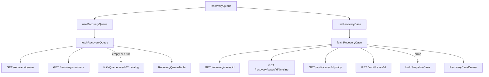

# Recovery Queue UI — Phase 8B

React operations page for inspecting every failed payment. Backend APIs,
schema, diagnosis, policy, planner, executor, audit, Gemini, simulator, and
Docker are unchanged. This app is UI only and **read-only**.

Package: `apps/frontend`

Route: `/recovery-queue`

---

## Component tree

```
App
  QueryClientProvider
    BrowserRouter
      DashboardLayout
        AppShell (sidebar + navbar)
          RecoveryQueue
            RecoveryFilters
            Sticky summary chips
            RecoveryQueueTable (windowed rows)
            RecoveryCaseDrawer
              CaseHeader
              DiagnosisCard
              PolicyCard
              PlannerCard
              ExecutorCard
              GeminiExplanationCard
              RecoveryTimeline
              AuditEventCard
```

Shared badges: `StatusBadge`, `PriorityBadge`.

Drawer sections, lifecycle, and audit JSON: `docs/CASE_DRAWER_UI.md`.

---

## Drawer lifecycle

1. Row click or `?case=<recovery_case_id>` sets the search param. The page
   does **not** navigate away from `/recovery-queue`.
2. `useRecoveryCase` enables only when `case` is present (lazy fetch).
3. TanStack Query caches by `["recovery-case", recovery_case_id]`.
4. ESC, backdrop click, or the close button deletes the query param.
5. Focus moves into the drawer on open (focus trap + Tab wrap). Focus
   returns to the previously focused row on close.
6. Framer Motion slides the panel from the right (~480px, 200ms).

Dashboard “Top customers at risk” rows deep-link to the same `?case=` param.

---

## API flow



Queue query params sent to the API: `merchant_id`, `status`, `failure_reason`,
`customer_segment`, `priority`, `payment_method`, `date_from`, `date_to`,
`page`, `page_size` (capped at 100).

Client-only filters (not on the queue API): search (name / payment id),
policy decision, planner strategy, amount range. They compose on the loaded
page. Pagination and sort run on that filtered set.

There is **no Gemini HTTP route**. Merchant / customer / compliance copy is
the local fallback template (`explanation_prompt_v1`, source `fallback`).

Display maps (plan name, planner strategy, policy fold, evidence catalog)
are UI-only. Engines are never imported or called.

---

## State management

| State | Owner |
| --- | --- |
| Merchant | `useMerchantDashboard` via layout outlet context |
| Filters / page / sort | local React state on `RecoveryQueue` |
| Queue + chips | TanStack Query `["recovery-queue", …]` |
| Open case id | URL `?case=` |
| Drawer payload | TanStack Query `["recovery-case", id]` |

Summary chips recompute when filters change. Unfiltered chips prefer
`GET /recovery/summary` when live; filtered chips count the loaded rows.

---

## Timeline rendering

`GET /recovery/cases/{id}/timeline` returns chronological events:

`payment_failed` · `diagnosis_created` · `action_scheduled` ·
`action_executed` · `webhook_update` · `audit`

The UI maps those to Diagnosis / Policy / Planner / Executor / Webhook /
Recovery icons. Events are sorted by `occurred_at`. Each row expands to
pretty-printed `details`. Snapshot cases synthesize the same event types
from the queue row so the drawer still demos when Postgres is down.

---

## Audit rendering

`GET /audit/cases/{id}` (fallback `GET /audit/events?recovery_case_id=`)
feeds `AuditEventCard`. Each card shows timestamp, actor, event type,
summary, request id, and correlation id. “Expand JSON payload” opens a
collapsible `<pre>` with token colors from the existing theme (keys =
info blue, strings = recovered green, numbers = waiting orange, literals =
AI purple). No highlight.js or other libraries.

---

## Status colors

| Status | Color |
| --- | --- |
| Recovered | Green |
| Waiting (retry) | Orange |
| Promise active | Purple |
| Escalated | Red |
| Stopped / Closed | Gray |
| Scheduled | Blue |

Priority bands match the queue API: HIGH ≥ 0.8, MEDIUM 0.6–0.8, LOW < 0.6.

---

## Constraints

No action buttons, retry execution, or case edits in this phase.
