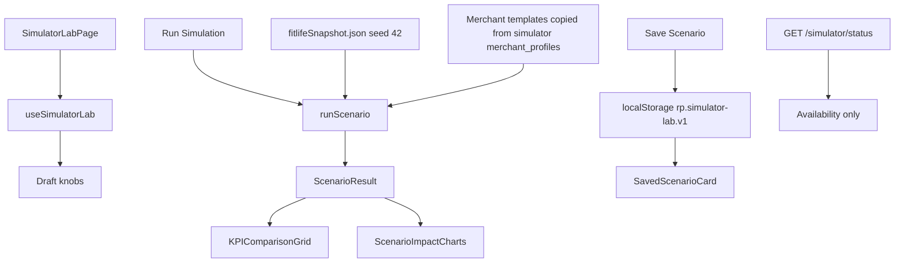

# Simulator Lab UI — Phase 10

Interactive playground on `/simulator`. Backend APIs, schema, diagnosis,
policy, planner, executor, Gemini, and the Python simulator package are
**unchanged**. The lab never calls Razorpay.

Package: `apps/frontend`

Route: `/simulator`

---

## Page layout

```
Simulator Lab
  Sticky SimulatorControlPanel (left / top on mobile)
  ScenarioSummaryCard
  KPIComparisonGrid (AI vs baseline + deltas)
  ScenarioImpactCharts
  AIScenarioInsights
  Saved scenarios
  ComparisonDrawer (seed 42 vs current)
```

Desktop: `18rem | 1fr` with sticky controls. Mobile: controls stack first.

---

## Component hierarchy

```
App → DashboardLayout → SimulatorLabPage
  SimulatorControlPanel
  ScenarioSummaryCard
  KPIComparisonGrid → StatCard
  ScenarioImpactCharts
    Funnel comparison (Recharts)
    DiagnosisStackedChart
    StrategyChart
    MixBarChart
    PaymentMethodChart
    Before/after revenue timeline
  AIScenarioInsights → InsightCard
  SavedScenarioCard[]
  ComparisonDrawer
    ScenarioDeltaCard[]
```

---

## Data flow



There is **no new HTTP route** and no batch job. `GET /simulator/status`
is the existing placeholder (`available`, `default_seed: 42`). The lab
still runs if that call fails.

TanStack Query key: `["simulator-status"]`.

---

## State management

| State | Owner | Notes |
| --- | --- | --- |
| `draft` | `useSimulatorLab` | Slider / toggle values. Not applied until Run. |
| `result` | same | Last computed `ScenarioResult`. Seed 42 on first paint. |
| `computing` | same | 280ms skeleton so KPI count-up and Recharts can remount. |
| `saved` | localStorage | Max 24 rows. Reload / delete are frontend-only. |
| `drawerOpen` | same | Seed 42 vs current. |

**Reset to Seed 42** restores FitLife defaults (`1200` customers, `15%`
failure rate, salary cycle on, festival off, downtime off, promise on,
immediate-retry baseline, seed `42`) and recomputes.

Changing merchant type copies that template's `enable_festival_calendar`
default (gym/SaaS off, OTT/EdTech on). Other knobs stay as the merchant
left them.

---

## Scenario engine

`runScenario` in `src/lib/simulatorLab.ts` is a **display map** over the
FitLife seed-42 snapshot. It does not import `simulator/`, call engines,
or sample new payments.

When knobs match FitLife seed 42, the function returns snapshot KPIs
verbatim:

| Metric | Value |
| --- | ---: |
| Revenue at risk | ₹8,42,250 |
| Recovered by AI | ₹5,83,495 |
| Recovery rate | 69.3% |
| Baseline recovered | ₹2,86,749 |
| AI lift | ₹2,96,746 |
| Harmful retries prevented | 117 |

Otherwise:

```
volume = (customerCount / 1200) × (failureRate / 0.15)
arpu   = profile_weighted_plan_paise / gym_weighted_plan_paise
jitter = 1 if seed = 42 else 0.97–1.03 (mulberry32)
```

Integer paise after every multiply. `arpu` uses the same plan prices and
weights as `simulator/src/simulator/merchant_profiles.py`.

### Toggle effects (applied to the snapshot, then scaled)

| Knob | Effect |
| --- | --- |
| Salary cycle off | Remove NSF share of AI lift (payday wait is the NSF edge). |
| Festival calendar on | +4% at-risk, −1.5% AI recovered, +6% baseline recovered (more transient UPI). |
| NPCI / bank downtime on | +6% at-risk, −1% AI recovered, +22% harmful retries, +15% suppressed revenue. |
| Promise-to-pay off | −8% AI recovered and outreach cost. |
| Wait 3 days baseline | Baseline gains 35% of NSF at-risk. |
| Payday-only baseline | Baseline gains 80% of NSF lift; fewer harmful retries (still no stop rules). |

Baseline **immediate retry** is the snapshot `generate_baseline` rule:
recover UPI / bank timeout / unknown; skip NSF and expired cards; count
already-paid / dispute / revoked / cancelled as harmful.

---

## Comparison logic

**Live KPI grid:** RecoveryPilot (`result.ai`) versus the selected
baseline (`result.baseline`). Delta = AI − baseline. Green when the
direction is better for the merchant (higher recovered / rate / lift /
prevented / compliance savings; **lower** at-risk and communication cost).

**Comparison drawer:** current AI column versus **seed 42 AI column**,
plus planner recovered-count shifts.

Communication cost uses snapshot `communication_costs.json` scaled by
volume. Baseline cost is `failed_invoices × 15 paise` (one SMS each),
matching the generator. Seed 42 AI spend is higher than baseline
(`saved_paise` is negative); that is preserved.

Compliance savings is snapshot `suppressed_revenue` (policy stops).

---

## Saved scenarios

Key: `rp.simulator-lab.v1`

```
{ id, name, saved_at, controls, result }
```

Name defaults to `Merchant · N cust · F% fail`. Reload calls
`runScenario(controls)` again so numbers stay consistent if the map
changes. Delete removes the row. Nothing is written to Postgres.

---

## KPI calculations

All money is integer **paise**. Rates are `recovered / at_risk`.

| Card | AI | Baseline |
| --- | --- | --- |
| Revenue at Risk | scaled at-risk | same |
| Revenue Recovered | scaled AI recovered | scaled baseline recovered |
| Recovery Rate | recovered / at-risk | recovered / at-risk |
| AI Lift | AI recovered − baseline recovered | 0 |
| Harmful Retries Prevented | scaled snapshot harmful | 0 (baseline causes them) |
| Compliance Savings | scaled suppressed revenue | 0 |
| Communication Cost | scaled AI outreach | `cases × 15` paise |

Charts reuse Analytics components. Diagnosis stacks snapshot failure
reasons × cohort status shares. Planner strategies are mapped from
diagnosis (`WAIT_FOR_PAYDAY` for NSF, silent retry for UPI/bank, and so
on). Segment and method mixes use the selected merchant template weights.

Insights are Gemini-shaped fallback cards (`source: "fallback"`,
`cached: true`, summary ≤160 chars): biggest leak, recommended strategy,
compliance risk, expected improvement.

---

## Constraints

Read-only. No retries, no executor, no Gemini HTTP, no Razorpay. The
Python batch simulator stays the source of the seed-42 snapshot; this
page only rescales it.
